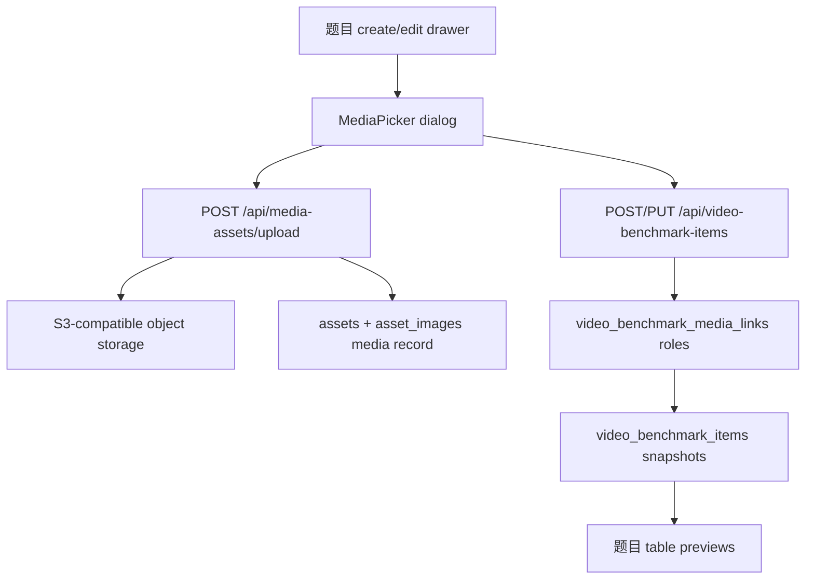

# feat: Add video uploads to benchmark items

## Summary

This plan extends the existing media-asset path so the “题目” tab can upload and select videos the same way it already handles image and audio materials. Video files will be stored in object storage, inserted into the shared material library, and linked to benchmark items through multi-select media associations while keeping the existing text snapshot fields compatible.

---

## Problem Frame

The “题目” tab currently supports selecting and uploading image/audio materials through the shared `assets + asset_images` model, but `视频输入` and `视频输出` remain plain text fields. Users need videos to follow the same durable material flow as images: upload to object storage, persist as library records, search/select from the item drawer, and preview from the table.

---

## Requirements

- R1. The “题目” create/edit drawer supports uploading video files to object storage.
- R2. Uploaded videos are inserted into the shared material library, not stored only as text on a benchmark item.
- R3. Benchmark items can link video input and video output materials, including multi-select support.
- R4. The existing text fields `video_input` and `video_output` remain as object-key snapshots for compatibility and table/search visibility.
- R5. The media selection dialog supports videos with readable metadata, search, pagination, upload, selection, clear, and preview states.
- R6. Backend validation rejects non-video media IDs for video fields and rejects video uploads with non-video content types.
- R7. Existing image/audio material behavior and benchmark item CRUD behavior remain unchanged.

---

## Scope Boundaries

- Do not build a separate standalone video asset management page in this iteration.
- Do not add transcoding, thumbnails, duration extraction, waveform generation, or streaming optimization.
- Do not change the `/images/{object_key}` route name in this iteration; it may continue to serve any private object key through a signed redirect despite the historical name.
- Do not migrate existing free-text `video_input` / `video_output` values into media IDs automatically.
- Do not remove existing single-media compatibility fields in this iteration.

### Deferred to Follow-Up Work

- Video thumbnail generation and duration metadata.
- Renaming `asset_images` to a neutral table name such as `asset_media`.
- A dedicated “全部素材库” page for managing uploaded image/audio/prop/video media outside the benchmark drawer.

---

## Context & Research

### Relevant Code and Patterns

- `backend/main.py` already has `/api/media-assets` and `/api/media-assets/upload` for image/audio upload and media listing.
- `backend/db.py` already centralizes media serialization, media validation, benchmark item CRUD, and multi-select media links.
- `backend/migrations/0003_extend_assets_media_for_benchmark_items.sql` introduced `asset_images.media_type` with an `image/audio` check constraint.
- `backend/migrations/0005_video_benchmark_media_links.sql` introduced `video_benchmark_media_links` with role-based multi-select material links.
- `frontend/src/components/BenchmarkItemDrawer.tsx` has the reusable `MediaPicker` dialog used by image/audio benchmark fields.
- `frontend/src/components/BenchmarkItemsPage.tsx` has table and expanded-row previews for linked media.
- `frontend/src/api.ts` already exposes `mediaAssetsApi.upload` and `mediaAssetsApi.list`.
- `frontend/src/types.ts` owns the `MediaAsset`, `MediaAssetListParams`, and `VideoBenchmarkItem` contracts.

### Institutional Learnings

- No `docs/solutions/` entries exist in this repo for video upload handling.

### External References

- External research is not needed for this iteration. The implementation follows the existing FastAPI upload, S3-compatible storage, and Ant Design upload patterns already present in the repo.

---

## Key Technical Decisions

- Extend the existing shared media model instead of creating benchmark-only video storage: this keeps image/audio/video selection consistent and satisfies the requirement that videos enter the material library.
- Add `video` as both a media type and an asset kind: media type answers “what file is this?”, while asset kind lets `/api/media-assets?media_type=video&asset_kind=video` list benchmark-uploaded video materials cleanly.
- Add dedicated benchmark media roles for `video_input` and `video_output`: these roles preserve the multi-select behavior already used for image/audio fields and avoid overloading the existing text fields as primary storage.
- Keep `video_input` and `video_output` as newline-joined object-key snapshots: this preserves old records and keeps simple table/search display available even when linked media is later deleted.
- Reuse the existing media picker dialog and table preview components: the new work should be an incremental extension, not another bespoke upload UI.

---

## Open Questions

### Resolved During Planning

- Should video upload be stored only on `video_input` / `video_output` text fields? No. The user explicitly asked for uploaded videos to enter the material library like image materials.
- Should video support cover only `视频输入` or both `视频输入` and `视频输出`? Both fields are video-bearing fields in the benchmark item model, so the plan includes both.

### Deferred to Implementation

- Exact browser preview behavior for large videos: implementation should start with native `<video controls>` and adjust sizing based on real UI behavior.
- Maximum upload size enforcement: no explicit product limit is defined yet, so the first implementation should rely on the existing server/proxy limits and keep room for a later policy.

---

## High-Level Technical Design

> *This illustrates the intended approach and is directional guidance for review, not implementation specification. The implementing agent should treat it as context, not code to reproduce.*

---

## Implementation Units

- U1. **Extend media schema for video**

**Goal:** Allow the shared media library to persist video assets and allow benchmark item links to point at video input/output roles.

**Requirements:** R2, R3, R4, R6, R7

**Dependencies:** None

**Files:**
- Create: `backend/migrations/0007_add_video_media_for_benchmark_items.sql`
- Modify: `backend/db.py`
- Test: `backend/tests/test_video_benchmark_video_media.py` if backend tests are introduced during implementation; otherwise verify through migration and API smoke checks.

**Approach:**
- Add `video` to the allowed `assets.kind` values.
- Add `video` to the allowed `asset_images.media_type` values.
- Extend `video_benchmark_media_links.role` to allow `video_input` and `video_output`.
- Add nullable `video_input_id` and `video_output_id` compatibility columns with `asset_images(id)` foreign keys and indexes.
- Add backend constants for video media type and asset kind.
- Extend benchmark media role configuration so `video_input` and `video_output` accept only `media_type='video'`.

**Patterns to follow:**
- Existing constraint replacement migrations in `backend/migrations/0003_extend_assets_media_for_benchmark_items.sql` and `backend/migrations/0004_add_prop_media_upload_support.sql`.
- Existing benchmark item media ID columns and indexes in `backend/migrations/0003_extend_assets_media_for_benchmark_items.sql`.
- Existing role-driven media validation in `backend/db.py`.

**Test scenarios:**
- Happy path: running migrations on a database that already has migrations through `0006` adds `video` support without dropping existing image/audio rows.
- Edge case: running the migration twice does not fail.
- Error path: a benchmark item payload using an image/audio ID for `video_input` or `video_output` is rejected.
- Integration: saving linked video media updates link rows and keeps `video_input` / `video_output` snapshots in sync.

**Verification:**
- The migration can be applied repeatedly.
- Existing image/audio benchmark records still list and update normally.

---

- U2. **Extend media upload/list API for video**

**Goal:** Make `/api/media-assets` and `/api/media-assets/upload` accept, validate, store, and return video materials.

**Requirements:** R1, R2, R5, R6, R7

**Dependencies:** U1

**Files:**
- Modify: `backend/main.py`
- Modify: `backend/db.py`
- Modify: `frontend/src/api.ts`
- Modify: `frontend/src/types.ts`
- Test: `backend/tests/test_media_assets_video_upload.py` if backend tests are introduced during implementation; otherwise verify through direct API smoke checks.

**Approach:**
- Allow `media_type=video` and `asset_kind=video` in API query validation.
- Accept only `video/*` content types for video uploads.
- Store uploaded videos under a video-specific object key prefix.
- Return video media records with the same `MediaAsset` shape used by image/audio records.
- Keep `thumbnail_url` empty for video until thumbnail generation exists.

**Patterns to follow:**
- Existing image/audio upload flow in `backend/main.py`.
- Existing `create_media_asset` validation in `backend/db.py`.
- Existing frontend `mediaAssetsApi.upload` query construction in `frontend/src/api.ts`.

**Test scenarios:**
- Happy path: uploading an `.mp4` or other `video/*` file creates a media asset with `media_type='video'` and `asset_kind='video'`.
- Happy path: listing `/api/media-assets?media_type=video&asset_kind=video` returns video materials.
- Error path: uploading a non-video file with `media_type=video` returns validation error.
- Error path: creating a video media asset with an image/audio-only kind is rejected.
- Regression: image and audio upload/list behavior remains unchanged.

**Verification:**
- API smoke checks can upload, list, and retrieve a video media record.
- Existing media picker still lists image/audio records for their current fields.

---

- U3. **Link video media to benchmark items**

**Goal:** Add benchmark item input/output fields for video material IDs and return linked video media summaries in item responses.

**Requirements:** R3, R4, R6, R7

**Dependencies:** U1, U2

**Files:**
- Modify: `backend/main.py`
- Modify: `backend/db.py`
- Modify: `frontend/src/types.ts`
- Test: `backend/tests/test_video_benchmark_video_links.py` if backend tests are introduced during implementation; otherwise verify through direct CRUD smoke checks.

**Approach:**
- Add create/update payload fields for `video_input_ids` and `video_output_ids`.
- Add create/update payload fields for compatibility single IDs `video_input_id` and `video_output_id`, while making the multi-ID arrays canonical for frontend use.
- Return `video_input_media`, `video_output_media`, `video_input_media_items`, `video_output_media_items`, `video_input_ids`, and `video_output_ids` in item responses.
- Use the same link table and role ordering model as image/audio fields.
- Keep `video_input` and `video_output` as snapshots derived from selected video object keys.

**Patterns to follow:**
- Existing `character_image_ids`, `scene_image_ids`, `prop_image_ids`, and `audio_input_media_ids` behavior in `backend/db.py`.
- Existing `VideoBenchmarkItemIn` model in `backend/main.py`.

**Test scenarios:**
- Happy path: creating an item with multiple video input IDs persists link rows, returns IDs in the same order, and saves snapshot object keys.
- Happy path: updating an item replaces prior video links and snapshots.
- Edge case: clearing video IDs sets the ID arrays empty and the snapshot text to empty.
- Error path: passing an image or audio media ID to a video field returns validation error.
- Regression: item create/update with only image/audio fields still works.

**Verification:**
- `GET /api/video-benchmark-items` returns linked video media arrays for saved rows.
- `GET /api/video-benchmark-items/{id}` returns the same video link data as list responses.

---

- U4. **Update the benchmark drawer video picker UI**

**Goal:** Let users upload, search, multi-select, clear, and preview videos from the “题目” create/edit drawer.

**Requirements:** R1, R3, R5, R7

**Dependencies:** U2, U3

**Files:**
- Modify: `frontend/src/components/BenchmarkItemDrawer.tsx`
- Modify: `frontend/src/types.ts`
- Test: none -- this repo currently has no frontend test harness; verify through TypeScript build and browser smoke.

**Approach:**
- Extend the reusable media field configuration to include `视频输入` and `视频输出` as video selectors.
- Use `accept="video/*"` for video uploads.
- Add video-specific preview rendering using native `<video controls>`.
- Preserve the existing text areas only as snapshot/compatibility fields if they remain visible, or make linked media the primary workflow while snapshots continue to update automatically.
- Make selected video cards readable in the drawer, including title/object-key metadata.

**Patterns to follow:**
- Existing image/audio `MediaPicker` and selected-media state in `frontend/src/components/BenchmarkItemDrawer.tsx`.
- Existing Ant Design `Upload` behavior used by character/scene drawers.

**Test scenarios:**
- Happy path: selecting existing video media adds it to `视频输入` and persists after save/reopen.
- Happy path: uploading a video from the picker uploads it, adds it to the selected set, and shows a video preview.
- Edge case: clearing selected videos and saving removes links.
- Error path: failed upload shows the backend error and keeps the drawer usable.
- Regression: image/audio picker behavior remains unchanged.

**Verification:**
- The drawer can create and edit records with video input/output media.
- Uploaded videos appear in the picker after upload.

---

- U5. **Update table previews and detail display for video**

**Goal:** Show linked video previews directly in the benchmark table and expanded details, consistent with image/audio previews.

**Requirements:** R5, R7

**Dependencies:** U3, U4

**Files:**
- Modify: `frontend/src/components/BenchmarkItemsPage.tsx`
- Modify: `frontend/src/index.css` if small table styling adjustments are needed.
- Test: none -- this repo currently has no frontend test harness; verify through TypeScript build and browser smoke.

**Approach:**
- Add compact video preview columns for `视频输入` and `视频输出`.
- Extend shared preview rendering so `media_type='video'` shows a native video player or clear video placeholder depending on table density.
- Keep long text fields wrapping in table cells.
- Ensure table scroll width accounts for the new columns without hiding existing controls.

**Patterns to follow:**
- Existing `MediaPreviewStack` and `MediaDetail` components in `frontend/src/components/BenchmarkItemsPage.tsx`.

**Test scenarios:**
- Happy path: rows with linked videos show video previews in the table.
- Happy path: expanded row displays playable video controls.
- Edge case: rows with only legacy text snapshots still show readable text instead of broken preview elements.
- Regression: image/audio previews still render.

**Verification:**
- Main table and expanded detail display linked video media without layout breakage.

---

- U6. **Run integration verification and deploy**

**Goal:** Prove the feature works end-to-end and update the running server.

**Requirements:** R1, R2, R3, R4, R5, R6, R7

**Dependencies:** U1, U2, U3, U4, U5

**Files:**
- Modify: no feature files expected unless verification finds issues.
- Test: none -- verification unit.

**Approach:**
- Run backend syntax checks and frontend production build.
- Apply migrations in a real environment before restart.
- Smoke test health, media upload/list, benchmark create/update, and table-facing list response.
- Use a small temporary video file for smoke testing, then delete any temporary benchmark row if created.

**Patterns to follow:**
- Existing deployment and smoke-check workflow used for prior benchmark item changes.

**Test scenarios:**
- Integration: migration applies and service starts.
- Integration: video upload creates an object-storage-backed material record.
- Integration: benchmark item create/update with video IDs returns linked video media arrays.
- Regression: existing `/api/video-benchmark-items?limit=1&offset=0` still returns image/audio fields.

**Verification:**
- Backend and frontend build checks pass.
- Remote `/api/health` returns healthy.
- Remote API returns video media data for a saved benchmark item.

---

## System-Wide Impact

- **Interaction graph:** The drawer calls `/api/media-assets/upload`, then saves IDs through `/api/video-benchmark-items`; the table reads linked media arrays from list/get responses.
- **Error propagation:** Upload and ID-validation errors should continue surfacing through FastAPI `detail` and the existing frontend request helper.
- **State lifecycle risks:** Video upload creates both an object-storage object and DB rows. If DB insertion fails after upload, orphan cleanup is a possible future hardening point but not currently handled for image/audio either.
- **API surface parity:** Media APIs and frontend types must include `video` wherever `image/audio` are accepted.
- **Integration coverage:** Manual/API smoke is required because the repo has no committed backend/frontend test harness.
- **Unchanged invariants:** Existing character/scene image APIs, image/audio benchmark selection, score validation, and text snapshot compatibility should not change.

---

## Risks & Dependencies

| Risk | Mitigation |
|------|------------|
| Large video uploads exceed proxy/server limits | Keep implementation aligned with existing upload path and document that explicit size policy is deferred. |
| Constraint migrations fail on already-mutated databases | Use constraint replacement patterns already used in prior migrations and make migration idempotent. |
| Video previews make the table too heavy | Use compact previews in table cells and reserve full controls for detail/drawer views where needed. |
| Orphaned object if DB insert fails after upload | Accept current image/audio parity for v1; note as future cleanup hardening. |

---

## Documentation / Operational Notes

- The migration must run before frontend users can save video material links.
- Deployment should keep excluding `backend/.env` when syncing to the server.
- If a production upload size policy becomes necessary, document it alongside proxy/server config in a follow-up.

---

## Sources & References

- Related plan: `docs/plans/2026-05-25-001-feat-benchmark-items-frontend-plan.md`
- Backend API patterns: `backend/main.py`
- Backend media/data patterns: `backend/db.py`
- Existing migrations: `backend/migrations/0003_extend_assets_media_for_benchmark_items.sql`, `backend/migrations/0005_video_benchmark_media_links.sql`
- Frontend drawer pattern: `frontend/src/components/BenchmarkItemDrawer.tsx`
- Frontend table preview pattern: `frontend/src/components/BenchmarkItemsPage.tsx`
