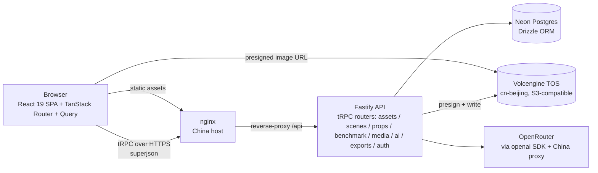
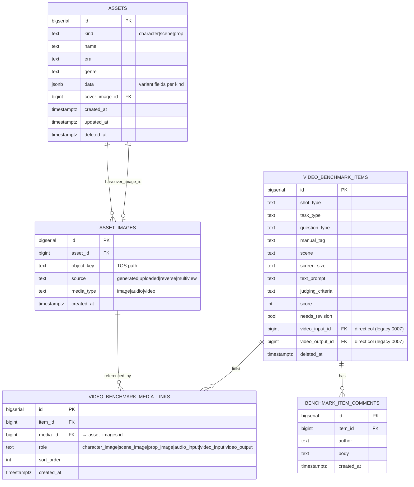
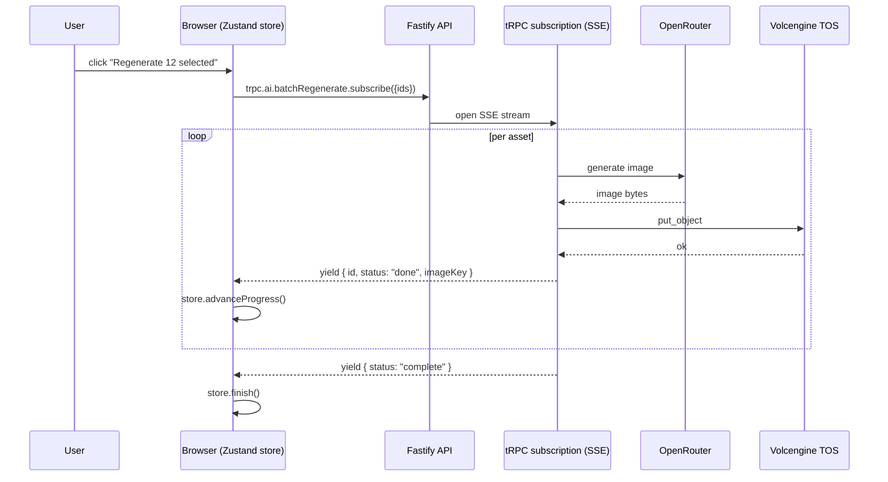
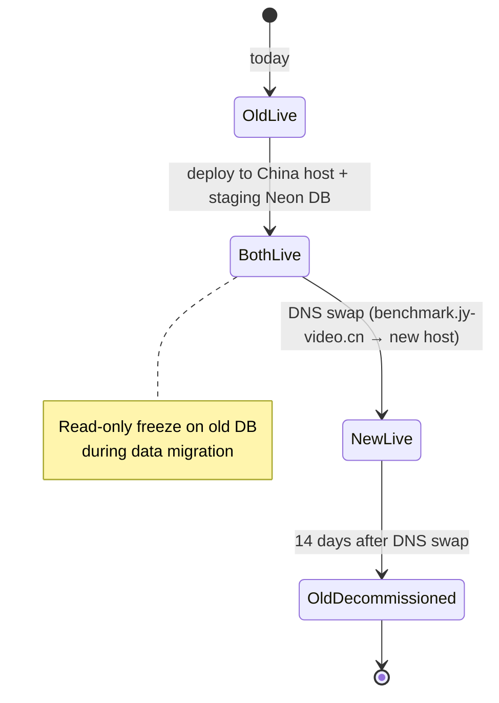

# Asset Library Stack Rebuild

**Target location:** a new project under `benchmark-admin/`. All file paths in this plan are relative to that directory (e.g. `apps/server/src/index.ts` means `benchmark-admin/apps/server/src/index.ts`), not to the existing `backend/` + `frontend/` app.

## Summary

Rewrite the 角色与场景资产库 (Character & Scene Asset Library) from FastAPI + React/AntD on a single VM onto the team's preferred TypeScript stack: a pnpm monorepo with a **Fastify API server (tRPC v11 + Drizzle + Neon)** and a **React 19 + TanStack Router SPA**, calling OpenRouter through a plain OpenAI-compatible client (the `openai` SDK — no Vercel AI SDK). The app **deploys to a long-lived China-region host co-located with TOS-Beijing — not Vercel** — so the locality that makes today's app work is preserved. Auth is a single hard-wired admin account (env credentials + signed cookie; no better-auth, no user table). Every existing feature across the four asset types (character, scene, prop, video benchmark) is preserved. Data migrates once to a fresh Neon database; TOS object keys are reused as-is. The current Python app stays running until a DNS swap at the end.

---

## Problem Frame

The current app works, but four properties make every change expensive:

- **Stack drift from the team's preferred patterns.** The team's stack playbook (`docs/stack-playbook.md`: tRPC, Drizzle, Zustand, coss UI, Vitest/PGlite, Biome) is now the reference architecture across other projects. The asset library is the lone holdout on FastAPI + React-hooks-only + AntD.
- **No type safety across the wire.** Pydantic on the server, hand-typed `types.ts` on the client. Field shapes drift silently — a JSONB key rename ships without a compile error.
- **All 56 routes live in `backend/main.py`.** Single-file growth pattern; module boundaries are implicit.
- **Operations are manual and bespoke.** Single VM, hand-rolled `deploy/deploy-remote.sh`, systemd unit, Nginx + certbot + htpasswd config that is not in version control as code. No CI, no tests.

The rebuild fixes all four by adopting the playbook patterns that fit: schema-derived types end-to-end, tRPC routers split per resource, a long-lived deploy on a China host co-located with TOS (not Vercel), Vitest + PGlite on day one, Biome instead of ad-hoc lint.

> **On the playbook.** `docs/stack-playbook.md` is a reference menu, not a contract. We adopt the patterns that fit this project (schema-derived types, tRPC, Drizzle, Vitest/PGlite, Biome, the Zustand recipe) and deviate where the project needs something different — every deliberate deviation is recorded as a KTD (e.g., the Neon **WebSocket Pool** driver in U4, chosen over the playbook's default HTTP driver because U12 needs interactive transactions). "Follow §X" below means "use §X as the reference," not "copy it verbatim."

> **Sequencing.** Build the new app first (Phases 1–4) against a fresh empty Neon DB; data migration is a separate later phase (Phase 5). The migration-specific findings (legacy `audio`/`video` asset kinds, the media-link table shape, the 56-route parity diff) are gated at Phase 5 — they do not block greenfield work, but each is a hard pre-cutover gate, not a best-effort step.

---

## Architecture: long-term vision and Milestone 1

### Long-term destination (context — NOT built in M1)

The asset library is the seed of a **video-generation benchmark platform**: test cases (a prompt plus reference assets) run against multiple models, producing generated videos that are then scored — structurally like SWE-bench, but for video. The pieces that implies — a generation harness (async provider calls with per-provider concurrency caps), a model registry, a media pipeline (ffmpeg thumbnails/HLS, HTTP range serving, multi-TB storage), human ratings + a leaderboard, run provenance, and eventually automated metrics (VBench / MLLM-as-judge, GPU) — all hang off **Postgres as the system of record plus a background worker**. M1 builds none of them; its only obligation is to avoid decisions that would foreclose them.

### Milestone 1 — what we build

The asset-library rebuild **at parity** (the 56 legacy routes) plus the one-shot data migration. Nothing from the benchmark-platform list above.

### M1 stack

| Layer | Choice |
| --- | --- |
| Server | **Fastify + `@trpc/server` Fastify adapter** — an open, standard Node API server (no Vercel, no SSR meta-framework) |
| Frontend | React 19 + TanStack Router + TanStack Query + Vite 7, built as a **static SPA** served by nginx |
| API | tRPC v11 + superjson |
| Auth | **single hard-wired admin account** — env credentials + a signed session cookie; no better-auth, no user/session tables |
| DB | **Neon** (Drizzle ORM + drizzle-zod), WebSocket Pool driver |
| AI | **OpenAI-compatible client (`openai` SDK) pointed at OpenRouter** via the existing China-side proxy — no Vercel AI SDK |
| Storage | Volcengine TOS (cn-beijing), presigned URLs |
| Long ops (image gen) | **long-lived HTTP request** on the host; durable pg-boss worker documented as the upgrade path (KTD-4) |
| Lint / test / env | Biome 2 / Vitest 4 + PGlite / @t3-oss/env-core |
| Deploy | systemd or container on a **China-region host (Volcengine) co-located with TOS-Beijing**, behind nginx |

**Load-bearing decisions (locked because reversal is expensive):** the China-region long-lived host co-located with TOS; Neon Postgres as the system of record. **Additive later (deferred, no rework):** the background worker, the generation harness, the model/run/ratings schema, the media pipeline, automated metrics.

**One accepted trade — Neon locality.** With compute in China and Neon's nearest region in Singapore, every DB query is a cross-border hop. This is the **status quo** — today's FastAPI app already runs China compute against Neon — so it is a known-tolerable hop, not a new risk; DB payloads are small, and the heavy bytes (images/video) stay China-local in TOS. If query latency ever bites, a China-region Postgres is the additive escape — Drizzle keeps the swap mechanical.

---

## High-Level Technical Design

### Runtime architecture



nginx on the China host serves the static SPA build and reverse-proxies `/api/*` to the Fastify server. In normal operation the browser talks to two places: the API (through nginx) and TOS directly via presigned URLs. AI calls and TOS writes happen server-side.

### Data model



There is **no users/sessions table** — auth is a single env-configured admin account verified at login, carried by a signed session cookie (KTD-3). This is the **hybrid** modeling decision (KTD-1): `kind`, `name`, `era`, `genre` get promoted to columns because they appear in every asset type and drive filters; everything else stays in `data` JSONB. Drizzle-zod generates the base row type, and we layer a Zod discriminated union (`character | scene | prop`) on top of `data` so each variant carries its own field shape.

**Media-links shape carried verbatim from legacy** (migrations 0005 + 0007): `video_benchmark_media_links` has a surrogate `bigserial id` PK, columns `item_id` / `media_id` (FK → `asset_images.id`, **not** `asset_image_id`) / `role` / `sort_order` / `created_at`, with `UNIQUE(item_id, role, media_id)`. The `role` vocabulary is the union of both migrations — `character_image`, `scene_image`, `prop_image`, `audio_input` (0005) plus `video_input`, `video_output` (0007). Note the **dual storage** the legacy schema introduced in 0007: `video_input`/`video_output` exist both as link rows *and* as direct `video_input_id`/`video_output_id` FK columns on `video_benchmark_items`. The migration (U20) and schema (U6) must preserve both representations or decide explicitly to collapse them.

### Long-running operation flow (batch regenerate / export)



Streaming a tRPC subscription over SSE keeps batch progress visible without a queue. On a long-lived host there is no function-duration ceiling to fight, so the stream simply runs to completion; each yielded item is durable in DB the moment it's emitted, so a dropped connection just means the client re-subscribes for the unfinished IDs. **Single image generation — the common case — is a plain long-lived HTTP request, no streaming needed.** Durability across tab-close/restart (a server-side queue) is the documented pg-boss upgrade (KTD-4), not an M1 feature.

### Cutover



---

## Output Structure

```
benchmark-admin/
├── apps/
│   ├── web/                            # React SPA (Vite, no SSR)
│   │   ├── index.html
│   │   ├── src/
│   │   │   ├── main.tsx                # SPA entry: createRouter + RouterProvider
│   │   │   ├── routes/                 # TanStack Router (client-only)
│   │   │   │   ├── __root.tsx
│   │   │   │   ├── index.tsx           # redirect → /characters
│   │   │   │   ├── login.tsx
│   │   │   │   ├── (assets)/
│   │   │   │   │   ├── characters.tsx
│   │   │   │   │   ├── scenes.tsx
│   │   │   │   │   └── props.tsx
│   │   │   │   └── benchmark.tsx
│   │   │   ├── components/
│   │   │   │   ├── asset-library/
│   │   │   │   ├── drawers/
│   │   │   │   ├── benchmark/
│   │   │   │   └── ui/                 # coss UI (generated, don't edit)
│   │   │   ├── lib/
│   │   │   │   ├── trpc.ts             # client → API base URL (/api/trpc)
│   │   │   │   └── auth-client.ts      # login/logout + session check
│   │   │   ├── stores/                 # zustand stores
│   │   │   │   └── batch-regenerate.ts
│   │   │   └── styles/
│   │   │       └── tailwind.css
│   │   ├── components.json             # coss UI
│   │   └── vite.config.ts              # SPA build (no Nitro)
│   └── server/                         # Fastify host
│       └── src/
│           └── index.ts                # Fastify bootstrap + fastifyTRPCPlugin + auth routes
├── packages/
│   ├── server/                         # domain code (imported by apps/server)
│   │   └── src/
│   │       ├── routers/
│   │       │   ├── assets.ts
│   │       │   ├── scenes.ts
│   │       │   ├── benchmark.ts
│   │       │   ├── media-assets.ts
│   │       │   ├── ai.ts
│   │       │   └── exports.ts
│   │       ├── services/
│   │       │   ├── storage/           # TOS / S3 client wrapper
│   │       │   ├── ai/                # openai SDK client (→ OpenRouter) + prompt registry
│   │       │   └── exports/           # ZIP + XLSX assembly
│   │       ├── db/
│   │       │   ├── schema.ts
│   │       │   └── index.ts           # Drizzle client (Neon WebSocket Pool)
│   │       ├── auth/
│   │       │   └── index.ts           # single-account verify + signed-cookie helpers
│   │       └── trpc/
│   │           ├── index.ts           # appRouter export
│   │           ├── context.ts         # reads + verifies session cookie
│   │           └── procedures.ts      # public / protected procedure builders
│   └── shared/
│       └── src/
│           ├── env.ts                 # @t3-oss/env-core
│           ├── schemas/
│           │   ├── assets.ts          # Zod discriminated union
│           │   ├── benchmark.ts
│           │   └── prompts.ts
│           ├── constants/
│           │   ├── orderings.ts       # TYPE_ORDER, GENRE_ORDER, AGE_ORDER
│           │   └── question-types.ts  # cascading shot/task/question hierarchy
│           └── lib/
│               └── prompts/           # 4 character variants + scene + prop
├── drizzle/
│   ├── migrations/                    # generated by drizzle-kit
│   └── seed.ts                        # 76 characters + 55 scenes + props
├── tools/
│   └── migrate-from-legacy/           # one-shot Python→Neon data migration
├── deploy/                            # nginx conf + systemd unit / Dockerfile for the China host
├── pnpm-workspace.yaml
├── .npmrc                             # node-linker=hoisted
├── tsconfig.base.json
├── biome.json
├── vitest.config.ts
├── drizzle.config.ts
└── .husky/pre-commit
```

---

## Requirements

### Asset CRUD and filtering

- R1. Character, scene, and prop assets each support create / read / update / soft-delete / restore.
- R2. List queries support multi-dimensional filters per asset type — character (era, type, gender, age, genre), scene (era, scene_type, genre, mood), prop (category) — plus 300ms-debounced free-text search across `name` and `data`.
- R3. Filter and search state lives in the URL so views are shareable and survive reload.
- R4. The deleted-only view is a toggle on each list page.
- R5. Per-asset cover image can be set from any image attached to the asset.

### AI features

- R6. Each asset type supports `generatePrompt` — turn structured fields into a model-ready prompt.
- R7. Each asset type supports `extractFields` — parse a freeform description into structured fields.
- R8. Each asset type supports `generateImage` — produce a new image, store it in TOS, attach it to the asset.
- R9. Character prompt generation honors four system-prompt variants (human / animal / creature / anthro); scene generation supports image-to-image variants (reverse-shot, 4-view).

### Media and storage

- R10. All images, audio, and video live in TOS; the database stores only object keys.
- R11. The client receives short-lived presigned TOS URLs (1 hour) for read access; the server never proxies image bytes.
- R12. The unified `mediaAssets` query lists images / audio / video across all asset kinds with dedup-by-`object_key`.

### Video benchmark

- R13. `videoBenchmarkItems` support create / read / update / soft-delete with the same filter pattern as assets, plus the cascading `shot_type → task_type → question_type` hierarchy.
- R14. Each item links to multiple media assets via roles: character images (many), scene images (many), prop images (many), audio input (one), video input (one), video output (one).
- R15. Items carry score, manual tag, and needs-revision flag; the comments thread per item supports add and delete.
- R16. Stats dashboard groups by `(shot_type, question_type)` with counts.

### Export and batch operations

- R17. ZIP export per asset type respects active filters and search; output contains one XLSX manifest and the original images.
- R18. Batch regenerate accepts a list of asset IDs, streams per-item progress to the client, and is resumable on stream interruption.

### Auth

- R19. The app sits behind a single hard-wired admin login (env-configured email + password, verified server-side; a signed http-only session cookie carries the session). No better-auth, no user/session tables. All tRPC procedures except `auth.*` and `health` require a valid session.

### Migration and cutover

- R20. A one-shot script migrates every row from the existing Neon DB into the new schema. TOS object keys are copied verbatim — image bytes are not re-uploaded.
- R21. The cutover is staged: deploy new app to the China host against a staging copy of the DB → freeze writes on the old app → run migration → DNS swap.
- R22. Rollback is reversible within 24 hours of cutover by flipping DNS back; the old DB is left untouched for 14 days.

### Quality and ops

- R23. Vitest projects exist for `web`, `server`, and `shared` from day one; server tests use PGlite with migrations applied at boot.
- R24. Biome formats and lints on pre-commit via husky + lint-staged.
- R25. Health endpoint reports DB, TOS, and AI connectivity.

---

## Key Technical Decisions

- **KTD-1. Hybrid schema (typed columns + JSONB) for asset types.** Promote the four fields that every kind uses and every filter touches (`kind`, `name`, `era`, `genre`) to columns; keep variant fields in `data` JSONB. Drizzle-zod derives the base row type; a Zod discriminated union (`{ kind: "character", ... } | { kind: "scene", ... } | { kind: "prop", ... }`) layers on top of `data`. Pure typed columns would force a separate table per kind and lose the shared `AssetLibrary` UI; pure JSONB sacrifices the playbook's single-source-of-truth rule. Hybrid is the smallest deviation from both.

- **KTD-2. Fresh Neon DB, one-shot SQL migration.** The current schema has 13 incremental migrations and naming inconsistencies (e.g., `media_type` added late). Designing the Drizzle schema cleanly and migrating once is cheaper than carrying every legacy quirk forward. The one-shot is a Drizzle script (TypeScript, runs against both DBs) — not raw SQL — so it can validate Zod shapes during the copy and surface bad rows early.

- **KTD-3. Single hard-wired admin account — no auth library.** The current app is one shared Basic-Auth login with no per-user data; M1 keeps exactly that. Credentials come from env (`ADMIN_EMAIL` / `ADMIN_PASSWORD`); the login endpoint verifies them (constant-time compare) and sets a signed, http-only session cookie (HMAC via `SESSION_SECRET`). No better-auth, no `users`/`sessions` tables, no auth-table generation — this is the smallest thing that satisfies R19. The earlier draft chose better-auth for team parity; we drop it here because a single account doesn't need session storage, plugins, or a user table, and the library is pure overhead at this scale. Extending to real multi-user auth later is additive — drop in better-auth (the playbook §2 option) and a `users` table at that point, not now.

- **KTD-4. Long-lived HTTP for single image-gen; SSE stream for batch progress; durable worker deferred.** We deploy on a long-lived host, so there is no serverless duration ceiling — a single image generation (the common case, ~minutes) is just a normal HTTP request. Batch regenerate streams per-item progress over an SSE tRPC subscription; each item is persisted before it's yielded, so a dropped connection means the client re-subscribes for the unfinished IDs. **The limit we knowingly accept for M1:** a closed tab / network drop loses the *in-flight* item, with no server-side queue record and no retry. The documented upgrade when that bites (or when video-gen lands) is a **Postgres-backed pg-boss worker** — `POST` enqueues a job and returns an id, the worker processes it, the client reads progress. Because we're already on a long-lived host with Postgres, that upgrade is additive (no re-platform); it is explicitly out of M1 scope. Recorded as a Risk (see Risk Analysis) so the next reviewer sees the trade.

- **KTD-5. Direct TOS presigned URLs handed to the client at query time.** Saves an API round-trip per image and lets the browser fetch bytes straight from TOS instead of proxying them through the server. The downside is exposing `*.volces.com` in the network panel; acceptable for an internal admin tool. The current `/images/{key}` redirect is replaced by `getPresignedUrl()` returning the signed URL inside each asset payload, with a 1-hour TTL.

- **KTD-6. tRPC v11 as the only API surface.** All client↔server calls go through tRPC, mounted on Fastify via `@trpc/server`'s `fastifyTRPCPlugin` — the playbook's "always tRPC" rule, minus the TanStack-Start-specific framing since we're not running an SSR meta-framework. tRPC gives an isomorphic client plus a vanilla caller in one type system; the vanilla caller is needed inside Zustand actions (batch regenerate).

- **KTD-7. Plain OpenAI-compatible client (`openai` SDK) pointed at OpenRouter — no Vercel AI SDK.** One `openai` client (`baseURL = OPENROUTER_BASE_URL`, the existing China proxy + key) covers text and image. **Carry the legacy `backend/ai.py` call shape verbatim — it is the only proven-working path:** text uses `chat.completions.create` with `model = TEXT_MODEL`; **image generation also goes through `chat.completions.create`** (the OpenRouter image models are exposed as multimodal chat output, *not* the `/images` endpoint) with `model = IMAGE_MODEL` and `extra_body: { modalities: ["image","text"], image_config: { aspect_ratio, image_size } }`, then reads the result from `choices[0].message.images[0].image_url.url` (a `data:` base64 URI, or an `http` URL to fetch). Image-to-image (reverse/multiview) inlines the reference image as a `data:image/png;base64,…` part in the user message `content`. Models and aspect/size come from env (`TEXT_MODEL`, `IMAGE_MODEL`, `IMAGE_ASPECT_RATIO`, `IMAGE_SIZE`), never hard-coded. `extractFields` does **not** rely on `response_format: json_schema` (unreliable across proxied models); it uses a plain prompt plus a tolerant brace-extraction JSON parse (the legacy `_parse_json`), validated against the Zod variant afterward.

- **KTD-8. drizzle-zod as the single source of truth.** Every Zod schema in `packages/shared/src/schemas/` either comes from `createInsertSchema()` / `createSelectSchema()` on a Drizzle table, or extends one of those. No hand-written shapes that mirror a DB column.

- **KTD-9. nuqs for filter and search state in URLs.** Replaces the localStorage tab-selection pattern in the current app. Bookmarks and share-links work; back/forward navigation works; deep linking to a filtered view becomes free.

- **KTD-10. TanStack Router file-based routing.** One file per top-level view: `/characters`, `/scenes`, `/props`, `/benchmark`, `/login`. Replaces the segmented-control tab UX with real routes and route-level loaders for the initial list payload.

- **KTD-11. Vitest `test.projects` split from day one.** Even with one project initially per the playbook's §5.7 guidance — keeps the PGlite swap-in trivial later.

---

## Scope Boundaries

In scope: every feature catalogued in this plan's Requirements. Behavior parity is the test — if the current app does X and Requirements list X, the rebuild does X. **Parity is verified, not assumed:** before cutover, U22 produces a route-inventory diff of the legacy 56 routes against the new tRPC surface so any behavior the Requirements failed to capture is caught, not silently dropped.

### Deferred to Follow-Up Work

- Deep image upload validation (dimension, MIME sniff). The current app trusts the client; we preserve that posture initially. **Note:** a hard upload size cap and login rate-limiting are *not* deferred — both are in scope now (U13, U8) as cheap blast-radius controls.
- Audit logs (who changed what, when).
- Analytics / usage metrics.
- Full-text search beyond ILIKE on `name` and `data`.
- Multi-user roles and per-user permissions (single admin only on day one).
- Replicated TOS / multi-region storage.
- Background job infrastructure (a Postgres-backed pg-boss worker) — documented in KTD-4 as the upgrade path; added when batch regen needs durability or video-gen lands, not in M1.

### Outside this product's identity

- Any feature not present in the current app. The rebuild is a stack migration, not a product evolution.
- Public-facing UI; this remains an internal admin tool.
- Mobile clients.

---

## Implementation Units

Units group into five phases by dependency. Each phase should land before the next begins because later phases assume earlier ones are wired and tested.

### Phase 1 — Foundation

#### U1. Monorepo skeleton and tooling

- **Goal:** stand up the empty monorepo with all the playbook's cross-cutting tooling so every later unit lands into a working dev loop.
- **Requirements:** R24
- **Dependencies:** none
- **Files:**
  - `pnpm-workspace.yaml`
  - `.npmrc`
  - `tsconfig.base.json`
  - `biome.json`
  - `.husky/pre-commit`
  - `package.json` (root, with lint-staged config)
  - `apps/web/package.json`, `packages/server/package.json`, `packages/shared/package.json` (workspace declarations only, no source yet)
- **Approach:** Follow playbook §4 as the layout reference. `node-linker=hoisted` in `.npmrc`. Biome at root with 2-space, 100col, single quotes per playbook §5.9. Husky + lint-staged run `biome format --write` on staged files. Strict `tsconfig` with `noUncheckedIndexedAccess: true` and path aliases (`@/lib/*`, `@/server/*`, `@/constant/*`, `@/env`, `@/*`).
- **Patterns to follow:** `docs/stack-playbook.md` §3-5 as reference.
- **Test scenarios:** Test expectation: none — pure scaffolding, exercised by every later unit.
- **Verification:** `pnpm install`, `pnpm lint`, `pnpm typecheck` all succeed at the root.

#### U2. App shell — Fastify server + Vite React SPA + Tailwind + coss UI

- **Goal:** boot a Fastify API server and a hello-world React SPA (Vite) that reaches it, with Tailwind v4 and coss UI ready to use. No SSR, no Vercel.
- **Requirements:** R23 (Vitest projects), R24
- **Dependencies:** U1
- **Files:**
  - `apps/server/src/index.ts` (Fastify bootstrap; `@fastify/cors` for the SPA origin; plain `/health` route)
  - `apps/web/index.html`
  - `apps/web/vite.config.ts` (SPA build: `@vitejs/plugin-react`, `vite-tsconfig-paths`, `@tailwindcss/vite`; dev proxy `/api` → Fastify port)
  - `apps/web/src/main.tsx` (createRouter + RouterProvider)
  - `apps/web/src/routes/__root.tsx`
  - `apps/web/src/routes/index.tsx`
  - `apps/web/src/styles/tailwind.css`
  - `apps/web/components.json` (coss UI config)
  - `vitest.config.ts` at root with `test.projects` declaration for `web`, `server`, `shared`
- **Approach:** Fastify with `@fastify/cors` allowing the SPA origin; a plain `/health` route for now (tRPC mounts in U3). Vite SPA with React + Tailwind v4 plugin + tsconfig-paths; in dev, Vite proxies `/api` to the Fastify port (nginx does the same in prod). Initialize coss UI per playbook §5.6 (read `coss.com/ui/llms.txt` first, don't reach for shadcn patterns). Add a single dummy button to prove the design system works.
- **Patterns to follow:** `docs/stack-playbook.md` §5.6 (coss UI) and §3 (Zustand/tRPC rules) as reference. The playbook's TanStack-Start / Nitro / Vercel setup (§5.1) is intentionally **not** followed — see KTD-6 and the Architecture section.
- **Test scenarios:**
  - Happy path: `pnpm --filter server dev` serves `/health`; `pnpm --filter web dev` serves the SPA root; vitest `web` project boots and runs a smoke test asserting `__root.tsx` renders without errors.
- **Verification:** SPA root renders in the browser and reaches the Fastify `/health`; smoke test passes.

#### U3. tRPC v11 + TanStack Query + superjson wiring

- **Goal:** end-to-end typed RPC call from the browser SPA to the Fastify server with `superjson` transport, mounted via the tRPC Fastify adapter.
- **Requirements:** baseline for every server-side R.
- **Dependencies:** U2
- **Files:**
  - `packages/server/src/trpc/index.ts` (`appRouter` export with one `health` procedure)
  - `packages/server/src/trpc/context.ts`
  - `packages/server/src/trpc/procedures.ts` (publicProcedure, protectedProcedure stubs)
  - `apps/server/src/index.ts` (extended: register `fastifyTRPCPlugin` at `/api/trpc`)
  - `apps/web/src/lib/trpc.ts` (client + vanilla caller; `httpBatchLink` → `/api/trpc`)
- **Approach:** Per playbook §5.2 for the tRPC + superjson shape; transport is mounted on Fastify via `@trpc/server/adapters/fastify` (`fastifyTRPCPlugin`) rather than a TanStack Start catch-all. Export `AppRouter` type from the server entry; client imports the type only. Vanilla caller (`trpcClient`) for use inside Zustand actions later. `superjson` transformer on both ends. Health procedure returns `{ ok: true, ts: Date }` so the Date round-trips through superjson and confirms the transformer.
- **Test scenarios:**
  - Happy path (server): calling `appRouter.createCaller(...).health()` returns `{ ok: true, ts: <Date instance> }`.
  - Integration: a React component using `trpc.health.useQuery()` renders the timestamp; PGlite not required since this procedure touches no DB.
- **Verification:** RPC works in browser; query devtools shows the request; `Date` arrives as a `Date`.

#### U4. Env validation + Neon driver setup

- **Goal:** every env var validated at boot via `@t3-oss/env-core`; Neon serverless client connected.
- **Requirements:** baseline for R10, R19.
- **Dependencies:** U1
- **Files:**
  - `packages/shared/src/env.ts`
  - `packages/server/src/db/index.ts` (configured Drizzle client with Neon WebSocket Pool driver — no schema yet)
  - `.env.example` at root
- **Approach:** Per playbook §5.8. Server-only vars: `DATABASE_URL`, `OPENROUTER_API_KEY`, `OPENROUTER_BASE_URL` (the China-side proxy), `TEXT_MODEL`, `IMAGE_MODEL`, `IMAGE_ASPECT_RATIO` (default `3:2`), `IMAGE_SIZE` (default `2K`), `TOS_BUCKET`, `TOS_REGION`, `TOS_ENDPOINT`, `TOS_ACCESS_KEY_ID`, `TOS_SECRET_ACCESS_KEY`, `SESSION_SECRET`, `ADMIN_EMAIL`, `ADMIN_PASSWORD`. The four AI model/format vars are carried from legacy `backend/ai.py` (`TEXT_MODEL`, `IMAGE_MODEL`, `IMAGE_ASPECT_RATIO`, `IMAGE_SIZE`) so model selection stays config-driven, never hard-coded (KTD-7). Client vars (none yet — UI text is all in-bundle). `runtimeEnv: process.env`. **Driver decision (deviation from playbook §5.3):** we keep Neon (per the locality trade in the Architecture section), and use the `@neondatabase/serverless` **WebSocket Pool** driver (`Pool` + `drizzle-orm/neon-serverless`), not the HTTP/fetch driver. The HTTP driver only supports non-interactive batched transactions; U12 needs an interactive `db.transaction()` (upsert an item, read its generated id, then insert media links keyed on that id, rolling back the item if a link fails). **On a non-serverless Node host the WebSocket driver needs an explicit `ws` constructor** — set `neonConfig.webSocketConstructor = ws` (the `ws` package) at db-module load, since there is no global `WebSocket` the way there is in serverless edge runtimes. Configure a modest pool size and idle timeout suited to a single long-lived process. The Pool driver is the one authoritative client for the whole app so transactional and non-transactional paths share it.
- **Test scenarios:**
  - Happy path: env loads with all required vars; `db.execute(sql\`select 1\`)` returns 1.
  - Error path: missing `DATABASE_URL` causes module-load to throw before any handler runs.
- **Verification:** boot fails fast on missing env; `db` connects to Neon.

### Phase 2 — Data layer

#### U5. Drizzle schema — assets, asset_images

- **Goal:** the full asset-side schema in Drizzle, with relations, soft-delete columns, and the discriminated-union Zod schema layered on `data`.
- **Requirements:** R1, R2, R4, R5, R10
- **Dependencies:** U4
- **Files:**
  - `packages/server/src/db/schema.ts` (assets, assetImages tables; `cover_image_id` self-FK pattern)
  - `packages/shared/src/schemas/assets.ts` (drizzle-zod-derived base + discriminated union on `data`)
  - `packages/shared/src/constants/orderings.ts` (TYPE_ORDER, GENRE_ORDER, AGE_ORDER carried verbatim from current `backend/db.py`)
  - `drizzle.config.ts`
  - `drizzle/migrations/0001_initial.sql` (generated by `pnpm db:gen`)
- **Approach:**
  - `assets` table: `id bigserial PK`, `kind text`, `name text`, `era text NULL`, `genre text NULL`, `data jsonb NOT NULL`, `cover_image_id bigint NULL`, `created_at`, `updated_at`, `deleted_at timestamptz NULL`.
  - GIN index on `data`, btree on `(kind, deleted_at)`, btree on `(kind, era)`, btree on `(kind, genre)`.
  - Per-kind Zod variant defines what `data` looks like: `CharacterDataSchema { type, gender, age, persona, body, features, prompt, description }`, `SceneDataSchema { scene_type, mood, elements, prompt, description }`, `PropDataSchema { category, prompt, description }`.
  - `AssetSchema = z.discriminatedUnion('kind', [CharacterAssetSchema, SceneAssetSchema, PropAssetSchema])` where each variant combines the base row Zod with the variant `data` Zod.
- **Technical design (directional):**
  ```ts
  // packages/server/src/db/schema.ts — directional, not the final file
  export const assets = pgTable('assets', {
    id: bigserial('id', { mode: 'number' }).primaryKey(),
    kind: text('kind').$type<'character' | 'scene' | 'prop'>().notNull(),
    name: text('name').notNull(),
    era: text('era'),
    genre: text('genre'),
    data: jsonb('data').notNull(),
    coverImageId: bigint('cover_image_id', { mode: 'number' }),
    createdAt: timestamp('created_at', { withTimezone: true }).defaultNow().notNull(),
    updatedAt: timestamp('updated_at', { withTimezone: true }).defaultNow().notNull(),
    deletedAt: timestamp('deleted_at', { withTimezone: true }),
  })
  ```
- **Test scenarios:**
  - Happy path: insert + select round-trips through Drizzle for a character; the parsed result satisfies `CharacterAssetSchema`.
  - Edge: insert with `data` shape that violates `CharacterDataSchema` (e.g., missing `prompt`) — fails Zod parse at the service boundary, never reaches DB.
  - Soft-delete: setting `deleted_at` excludes the row from the default list query but a `deletedOnly: true` flag re-includes it.
- **Verification:** `pnpm db:gen` produces a clean migration; `pnpm db:migrate` runs against PGlite without error.

#### U6. Drizzle schema — video benchmark tables

- **Goal:** video benchmark items, media link table, and comments table — schema complete.
- **Requirements:** R13, R14, R15, R16
- **Dependencies:** U5
- **Files:**
  - `packages/server/src/db/schema.ts` (extended)
  - `packages/shared/src/schemas/benchmark.ts`
  - `packages/shared/src/constants/question-types.ts` (cascading shot_type → task_type → question_type, carried verbatim from current `frontend/src/data/questionTypeOptions.ts`)
- **Approach:**
  - `videoBenchmarkItems` carries all scalar fields including `score int`, `needsRevision bool`, `manualTag text`, `judgingCriteria text`, `deletedAt timestamptz NULL`.
  - `videoBenchmarkItems` ALSO carries `videoInputId` / `videoOutputId` as direct `bigint` FK columns (the legacy 0007 dual-storage pattern — see the Data model note). Keep them so the migration is a verbatim copy; the link rows remain the canonical multi-image source.
  - `videoBenchmarkMediaLinks` carries the legacy shape verbatim: surrogate `id bigserial PK`, columns `itemId`, `mediaId` (FK → `assetImages.id`), `role`, `sortOrder int default 0`, `createdAt`. A `UNIQUE(itemId, role, mediaId)` constraint (not a compound PK) so the same image can fill two roles on one item, and `sortOrder` preserves ordering within a role. **Column is `mediaId`, not `assetImageId`** — match legacy so U20 maps 1:1.
  - `role` CHECK accepts the 6-value union of migrations 0005+0007: `character_image`, `scene_image`, `prop_image`, `audio_input`, `video_input`, `video_output`.
  - `benchmarkItemComments` carries `author text` (from session at insert time), `body text`, `createdAt`.
  - Indexes: `(shot_type, question_type)` for the stats dashboard; `(deletedAt)` for the default list filter; `(itemId)` on the link table for relation loads.
- **Test scenarios:**
  - Happy path: insert item + link 3 character images + 1 scene image + 1 video output; load the item with `with: { mediaLinks: true }` and confirm all 5 links present, ordered by `sortOrder`.
  - Edge: linking the same image twice in the same role fails the `UNIQUE(itemId, role, mediaId)` constraint; linking the same image twice in different roles succeeds.
- **Verification:** migration applies cleanly; relation loaders return shapes that satisfy `VideoBenchmarkItemSchema`.

#### U7. Storage layer — TOS via S3 client with presigned URLs

- **Goal:** TS equivalent of the current `backend/storage.py`: `putObject`, `getPresignedUrl`, `deleteObject`, `newObjectKey`.
- **Requirements:** R10, R11
- **Dependencies:** U4
- **Files:**
  - `packages/server/src/services/storage/index.ts`
  - `packages/server/src/services/storage/__tests__/storage.test.ts`
- **Approach:** Use `@aws-sdk/client-s3` configured against the TOS endpoint (Volcengine is S3-compatible). `getPresignedUrl()` uses `@aws-sdk/s3-request-presigner` with a 1-hour expiry. `newObjectKey(ext, prefix)` mirrors the current crypto-random UUID v4 + extension pattern. Prefixes: `images/`, `audios/`, `videos/`.
- **Test scenarios:**
  - Happy path: `putObject(key, bytes)` then `getPresignedUrl(key)` returns a URL whose GET succeeds and returns the same bytes.
  - Edge: `getPresignedUrl()` for a non-existent key still returns a signed URL (S3 contract) — caller is responsible for confirming the object exists.
  - Error path: invalid bucket → `putObject` rejects with a typed error; the AI router (U13) maps this to a user-visible message instead of letting the raw AWS error bubble.
- **Verification:** integration test using TOS staging bucket passes; unit tests mock S3 client via `aws-sdk-client-mock`.

### Phase 3 — Server layer

#### U8. Single-account auth — env credentials + signed cookie

- **Goal:** a single admin login with no auth library and no DB tables: verify env credentials, set a signed http-only session cookie; `protectedProcedure` checks it.
- **Requirements:** R19
- **Dependencies:** U3
- **Files:**
  - `packages/server/src/auth/index.ts` (verify credentials; sign/verify session cookie via HMAC)
  - `apps/server/src/index.ts` (extend: `@fastify/cookie`, `POST /api/auth/login`, `POST /api/auth/logout`)
  - `apps/web/src/lib/auth-client.ts` (login/logout calls + session check)
  - `packages/server/src/trpc/context.ts` (read + verify the session cookie)
  - `packages/server/src/trpc/procedures.ts` (`protectedProcedure` rejects without a valid session)
- **Approach:** Login compares the posted email/password against `ADMIN_EMAIL` / `ADMIN_PASSWORD` with a constant-time compare; on success it sets an http-only, `SameSite=Strict`, `Secure` cookie holding an HMAC-signed token (`SESSION_SECRET`) plus an expiry. Context verifies signature + expiry to populate `session`; `protectedProcedure` throws `UNAUTHORIZED` otherwise. No `users` / `sessions` tables, no better-auth.
  - **Token shape (explicit):** the cookie value is `base64url(payload) + "." + base64url(HMAC-SHA256(payload, SESSION_SECRET))`, where `payload = { jti, iat, exp }`. `jti` is a random 128-bit nonce. Session TTL is explicit (e.g. 12h via `exp`); verify recomputes the HMAC in constant time and rejects on signature mismatch or `exp` past. Stating the algorithm and TTL here keeps the "roll your own" token honest — it is a signed token, not encryption, and carries no secret beyond the admin's already-authenticated identity.
  - **Logout / revocation:** `POST /api/auth/logout` clears the cookie and adds the token's `jti` to a small in-memory revocation set (entries auto-expire at the token's `exp`, so the set stays bounded). `protectedProcedure` rejects any `jti` in that set. This is single-process state — acceptable because we deploy one long-lived host (KTD-4); if the process restarts, outstanding tokens simply expire on their own TTL. A persistent denylist is the additive upgrade if multi-instance ever lands.
  - **CSRF:** `SameSite=Strict` already blocks cross-site cookie attachment for this internal tool (no cross-site nav into it is expected). As defense-in-depth, the tRPC HTTP handler additionally requires a non-simple header (e.g. tRPC's `content-type: application/json` plus an `x-trpc-source` check) on mutations so a form-based cross-site POST cannot forge a state change even if a future relaxation of `SameSite` slips in.
  - **Login rate-limiting (in scope):** a small per-IP attempt cap with backoff on the login route (`@fastify/rate-limit` scoped to `/api/auth/login`, or an equivalent nginx limit). The single login is full-blast-radius under credential stuffing, so this stays a required control even without an auth library.
- **Test scenarios:**
  - Happy path: login with env credentials → signed cookie set → a subsequent `protectedProcedure` call succeeds.
  - Error: wrong password → 401, no cookie; missing / forged / expired cookie → `protectedProcedure` returns `UNAUTHORIZED`.
  - Rate limit: N rapid failed logins from one IP → subsequent attempts throttled.
  - Revocation: login → logout → the same cookie now fails `protectedProcedure` (its `jti` is in the revocation set) even though the HMAC still verifies.
- **Verification:** server tests in `packages/server/src/auth/__tests__/auth.test.ts` cover sign/verify, happy, unauthorized, a tampered-cookie case (modified token fails verification), and post-logout revocation.

#### U9. AI service — `openai` SDK + OpenRouter, prompt registry

- **Goal:** one AI module wrapping the `openai` client with `generatePrompt`, `generateImage`, `extractFields` helpers callable from any tRPC procedure; system prompts centralized.
- **Requirements:** R6, R7, R8, R9
- **Dependencies:** U7
- **Files:**
  - `packages/server/src/services/ai/index.ts`
  - `packages/server/src/services/ai/openrouter.ts` (a single `openai` client + `parseJson` helper ported from legacy `_parse_json`)
  - `packages/shared/src/lib/prompts/character.ts` (human, animal, creature, anthro variants)
  - `packages/shared/src/lib/prompts/scene.ts`
  - `packages/shared/src/lib/prompts/prop.ts`
  - `packages/shared/src/lib/prompts/extract-fields.ts`
  - `packages/server/src/services/ai/__tests__/ai.test.ts`
- **Approach:** Port `backend/ai.py` shape-for-shape — it is the only proven path against this OpenRouter proxy. Do not invent a cleaner API surface (see KTD-7).
  - Client: one shared `new OpenAI({ apiKey: env.OPENROUTER_API_KEY, baseURL: env.OPENROUTER_BASE_URL, timeout: 600_000 })`.
  - Text: `client.chat.completions.create({ model: env.TEXT_MODEL, messages: [{ role: 'system', content: system }, { role: 'user', content: prompt }], temperature: 0.7 })`; return `choices[0].message.content`.
  - Image: `client.chat.completions.create({ model: env.IMAGE_MODEL, messages: [{ role: 'user', content }], ...({ modalities: ['image','text'], image_config: { aspect_ratio: env.IMAGE_ASPECT_RATIO ?? '3:2', image_size: env.IMAGE_SIZE ?? '2K' } } as extra body) })`. Read bytes from `choices[0].message.images[0].image_url.url` — branch on `data:` (base64-decode) vs `http` (fetch) — then pipe to `storage.putObject()`. For image-to-image, `content` is `[{ type: 'text', text: prompt }, { type: 'image_url', image_url: { url: 'data:image/png;base64,'+b64 } }]`; otherwise `content` is the plain prompt string.
  - Extract: plain prompt (candidate `options` passed in the user message, as legacy does), then a tolerant brace-extraction parse (port `_parse_json`, tolerate markdown fences), and finally validate against the Zod variant. No `response_format: json_schema`.
  - System prompts live in `packages/shared/src/lib/prompts/` mirroring the current 4 character variants verbatim. Variant selection is by `data.type` for characters; scene/prop use one prompt each.
- **Technical design (directional):**
  ```ts
  // packages/server/src/services/ai/index.ts — directional
  export async function generateCharacterPrompt(input: CharacterInput): Promise<string> {
    const variant = pickCharacterVariant(input.type) // human|animal|creature|anthro
    const system = CHARACTER_PROMPTS[variant]
    const res = await client.chat.completions.create({ model: env.TEXT_MODEL, messages: [{ role: 'system', content: system }, { role: 'user', content: serialize(input) }], temperature: 0.7 })
    return res.choices[0].message.content ?? ''
  }
  ```
- **Test scenarios:**
  - Happy path (mocked provider): each of the 4 character variants returns a non-empty string when called with a matching input shape.
  - Happy path: `extractFields` for a sample description returns a `CharacterDataSchema`-shaped object.
  - Error: provider rate-limit response surfaces as a typed `AI_RATE_LIMITED` error the router can map to a 429.
- **Verification:** AI tests pass with the mocked `openai` client; manual smoke against staging OpenRouter key returns real content.

#### U10. assetsRouter (shared CRUD for character / scene / prop)

- **Goal:** one router that powers list / get / create / update / delete / restore for all three asset kinds, plus image attach / detach / set-cover.
- **Requirements:** R1, R2, R3, R4, R5
- **Dependencies:** U5, U7, U8
- **Files:**
  - `packages/server/src/routers/assets.ts`
  - `packages/server/src/routers/__tests__/assets.test.ts`
- **Approach:**
  - Input schemas: `list({ kind, filters, search, deletedOnly, cursor })`, `get({ id })`, `create({ kind, ...input })`, `update({ id, ...input })`, `delete({ id })`, `restore({ id })`, `attachImage({ id, objectKey, source })`, `deleteImage({ imageId })`, `setCover({ id, imageId })`.
  - List uses cursor-based pagination per playbook §3 ("Never offset"); cursor = `id` of the last row, ordering by `id desc`.
  - Asset response always includes `images` array and each image carries a `url` field — the presigned URL computed at query time.
  - Filter application is dynamic per kind: characters filter on `era, type, gender, age, genre`; scenes on `era, scene_type, genre, mood`; props on `category`.
- **Test scenarios:**
  - Happy path: create a character → list → get returns the row with the variant `data` shape correctly typed.
  - Filters: insert 5 characters with mixed `era` and `genre`; list with `{ era: ["古代"] }` returns only the matching subset.
  - Pagination: insert 25 rows; first page returns 20 + cursor; second page returns 5.
  - Soft delete: delete → list (default) excludes the row → list with `deletedOnly: true` includes it → restore returns it to default list.
  - Cover: attach 2 images → set the second as cover → response shows `coverImageId` matches.
- **Verification:** all scenarios pass against PGlite; cursor semantics match what the client sends.

#### U11. scenesRouter extension

- **Goal:** scene `generateView` (reverse-shot, 4-view).
- **Requirements:** R9
- **Dependencies:** U9, U10
- **Files:**
  - `packages/server/src/routers/scenes.ts`
  - `packages/server/src/routers/__tests__/scenes.test.ts`
- **Approach:**
  - `scenes.generateView({ id, mode: "reverse" | "multiview" })` reads the cover image bytes from TOS, calls the AI service's image path with the cover bytes as the inlined `data:` reference (the same `chat.completions` + `modalities` call as U9, ref image as a base64 `image_url` part — not a separate edit endpoint), uploads the result with `source: mode`, and attaches it.
  - **No `propsRouter`.** Props are fully covered by `assetsRouter`; there is no prop-only behavior in M1, so we do not create an empty router for it. Add one only when a prop-specific operation actually appears (YAGNI per the build-minimal steer).
- **Test scenarios:**
  - Happy path (mocked): `generateView({ mode: "reverse" })` calls AI with the cover image bytes, gets back new bytes, persists with `source: "reverse"`.
  - Error: scene without a cover image → `BAD_REQUEST` "Set a cover image first."
- **Verification:** tests pass with mocked AI + storage.

#### U12. videoBenchmarkRouter

- **Goal:** all benchmark item operations including stats and comments.
- **Requirements:** R13, R14, R15, R16
- **Dependencies:** U6, U8, U10
- **Files:**
  - `packages/server/src/routers/benchmark.ts`
  - `packages/server/src/routers/__tests__/benchmark.test.ts`
- **Approach:**
  - Procedures: `list`, `get`, `create`, `update`, `delete`, `restore`, `setNeedsRevision`, `stats`, `comments.list`, `comments.add`, `comments.delete`.
  - Stats returns `{ shotType, questionType, count }[]` via a `GROUP BY` query.
  - Create / update accept the full media-link bundle (`{ characterImageIds, sceneImageIds, propImageIds, audioInputId, videoInputId, videoOutputId }`); router upserts links transactionally inside an interactive `db.transaction()` (requires the WebSocket Pool driver chosen in U4 — the HTTP driver cannot run this).
  - Comments use the authenticated user's email as `author`.
- **Test scenarios:**
  - Happy path: create item with 3 character + 1 scene + 1 video → load → all 5 links present and grouped by role on the response.
  - Stats: insert 10 items across 2 shot_types × 2 question_types → stats returns 4 rows with correct counts.
  - Comment delete: only the comment author or admin can delete (single admin satisfies both for now).
- **Verification:** tests pass; transaction rollback on link-insert failure leaves item un-created.

#### U13. mediaAssetsRouter + ai router + exports router

- **Goal:** the remaining three routers — unified media listing, AI procedures wired to the AI service, and the export endpoint.
- **Requirements:** R6, R7, R8, R12, R17
- **Dependencies:** U9, U10, U11, U12
- **Files:**
  - `packages/server/src/routers/media-assets.ts`
  - `packages/server/src/routers/ai.ts`
  - `packages/server/src/routers/exports.ts`
  - `packages/server/src/services/exports/index.ts`
  - `packages/server/src/routers/__tests__/exports.test.ts`
- **Approach:**
  - `mediaAssetsRouter.list({ kind?, mediaType?, dedup })`: joins `asset_images` to `assets`, optionally dedups by `object_key`, returns presigned URLs.
  - Upload path: a Fastify multipart route (`@fastify/multipart`) streams the file to the storage service and returns the resulting `object_key`; the tRPC `mediaAssetsRouter.attach` then inserts the image row. The TOS write happens first; on insert failure, schedule a deferred delete to avoid leaking objects (recorded as a Risk). **Upload size cap (in scope):** enforce a hard `Content-Length` / multipart byte limit (reject oversized uploads before buffering the body) so a single authenticated upload can't exhaust host memory or inflate the bucket unbounded. This is the one upload control we pull forward; deeper validation (dimension, MIME sniff) stays deferred.
  - `aiRouter.generatePrompt({ kind, input })`, `extractFields({ kind, description })`, `generateImage({ kind, id, prompt, refImage?, aspectRatio? })`. `generateImage` handles `refImage` the same way U9 does — fetch the referenced image bytes from TOS and inline them as a `data:image/png;base64,…` part on the chat message; there is no separate edit endpoint. Each maps to the matching AI service function and persists results.
  - `exportsRouter.exportZip({ kind, filters, search })`: streams a ZIP over a **raw Fastify route** (not a tRPC procedure — tRPC has no byte-stream response). The `archiver` stream is piped directly into the Fastify `reply` and entries are appended as they're fetched; `archive.finalize()` only signals "no more entries," it does not buffer. **Do not `finalize()` then `yield*` the archive** — that deadlocks, because the archive's internal buffer fills and back-pressures the appends while nothing is draining it yet. The consumer (the HTTP reply) must be attached *before* finalize so bytes drain as they're produced. `exceljs` builds the XLSX manifest; `archiver` builds the ZIP. Streaming avoids buffering hundreds of MB on the host.
  - **Download disposition:** the raw route sets `Content-Disposition: attachment; filename="…"` on the reply. For any presigned-URL download of a non-image object (audio/video/zip via `getPresignedUrl`), pass `ResponseContentDisposition: 'attachment'` so the browser downloads rather than navigates/inlines.
- **Technical design (directional):**
  ```ts
  // packages/server/src/routers/exports.ts — directional raw route
  app.get('/api/export/:kind.zip', { preHandler: requireSession }, async (req, reply) => {
    const rows = await loadAssets(req.query)
    const archive = archiver('zip')
    reply.header('Content-Type', 'application/zip')
    reply.header('Content-Disposition', `attachment; filename="${req.params.kind}-export.zip"`)
    reply.send(archive)            // attach the drain target BEFORE appending/finalizing
    archive.append(await buildXlsxBuffer(rows), { name: `${req.params.kind}-manifest.xlsx` })
    for (const row of rows)
      for (const img of row.images)
        archive.append(await tosGet(img.objectKey), { name: `images/${row.id}/${img.id}.png` })
    await archive.finalize()       // signals end-of-entries; bytes already draining to reply
  })
  ```
- **Test scenarios:**
  - Media list: 3 assets with shared images dedup to fewer rows; without dedup returns all rows.
  - Export ZIP: list of 5 assets → resulting ZIP contains the XLSX + 1 image per row + correct row count in the XLSX.
  - AI procedures: each delegates to the service module mocked at the boundary.
- **Verification:** export ZIP opens cleanly in a real ZIP tool; XLSX opens in Excel; image files inside are intact PNGs.

#### U14. AI batch regenerate progress as a tRPC subscription (SSE)

- **Goal:** the batch-regenerate long-running operation exposes a subscription that streams per-item progress so the client can render a progress bar without polling.
- **Requirements:** R18
- **Dependencies:** U13
- **Files:**
  - `packages/server/src/routers/ai.ts` (extended with `batchRegenerate` subscription)
  - `packages/server/src/routers/__tests__/ai-batch.test.ts`
  - `apps/web/src/lib/trpc.ts` (configure `httpSubscriptionLink` for SSE)
- **Approach:**
  - **Batch regenerate only.** Export (R17) is a one-shot ZIP *download* over the raw route in U13 — it has no progress UI and no subscription. There is no `exportZipStream`; the `AsyncIterable`/`archiver` stream in U13 exists purely for memory (drain-as-you-go), not for client progress.
  - Subscription emits `{ id, status: "pending" | "done" | "failed", imageKey?, error? }` per item.
  - **Resumption contract — one model, not two.** The client retains a `Set<id>` of completed items; on stream end without `status: "complete"`, it invokes the subscription again with the remaining IDs. We deliberately do **not** also use tRPC's automatic `lastEventId` reconnect for this stream — mixing the two means an event could be replayed by `lastEventId` *and* skipped by the Set, double-counting progress. The manual-Set model is authoritative; `httpSubscriptionLink` reconnection is left at its transport default but resumption decisions are driven solely by the Set.
  - Each item's DB write happens before the yield, so server crashes don't lose work — the next subscription call sees the persisted row and skips it.
- **Test scenarios:**
  - Happy path: subscribe with 3 IDs → 3 yields with `status: "done"` followed by `status: "complete"`.
  - Resumption: 5 IDs, force-fail after 2 → second subscription with the remaining 3 IDs completes them.
  - Per-item failure: 1 of 3 fails → yield includes `status: "failed", error`; other 2 succeed; subscription completes without throwing.
- **Verification:** UI consumer in U19 renders progress against a real subscription end-to-end.

### Phase 4 — Frontend

#### U15. TanStack Router route tree + root layout + auth UI

- **Goal:** five top-level routes wired, root layout with nav, login page.
- **Requirements:** R19; baseline for R1, R13
- **Dependencies:** U8
- **Files:**
  - `apps/web/src/routes/__root.tsx` (layout shell with nav + auth guard)
  - `apps/web/src/routes/index.tsx` (redirect → `/characters`)
  - `apps/web/src/routes/login.tsx`
  - `apps/web/src/routes/(assets)/characters.tsx`, `scenes.tsx`, `props.tsx` (placeholders)
  - `apps/web/src/routes/benchmark.tsx` (placeholder)
  - `apps/web/src/lib/auth-client.ts`
- **Approach:** Root layout reads session via `auth-client.ts`; unauthenticated → redirect to `/login`. Nav uses coss UI nav primitives, mirrors the current segmented control with router-link semantics.
- **Test scenarios:**
  - Happy path: unauthenticated visit to `/characters` → redirect to `/login`; sign in → land on `/characters`.
  - Edge: sign out from anywhere → return to `/login`.
- **Verification:** all five routes navigate; auth guard works.

#### U16. Shared AssetLibrary primitives

- **Goal:** the reusable list/grid + filter + lazy-image primitives that all three asset routes consume.
- **Requirements:** R1, R2, R3, R5
- **Dependencies:** U10, U15
- **Files:**
  - `apps/web/src/components/asset-library/AssetLibrary.tsx`
  - `apps/web/src/components/asset-library/FilterPanel.tsx`
  - `apps/web/src/components/asset-library/AssetCard.tsx`
  - `apps/web/src/components/asset-library/LazyImage.tsx`
  - `apps/web/src/components/asset-library/useFilters.ts` (nuqs-backed URL state)
  - `apps/web/src/components/asset-library/__tests__/AssetLibrary.test.tsx`
- **Approach:**
  - `useFilters()` returns `{ filters, search, deletedOnly, setFilter, setSearch }`, all backed by nuqs (`useQueryState`) per playbook §3.
  - `AssetLibrary<T extends Asset>` is a generic over the asset kind; takes `kind` + `filterFields` + `renderCard` and handles list query, infinite scroll via TanStack Query, drawer state.
  - `LazyImage` uses native `loading="lazy"` first; falls back to IntersectionObserver if a placeholder needs custom render.
  - Search debouncing via `use-debounce`.
- **Test scenarios:**
  - Happy path: render with mocked tRPC client returning 3 assets → 3 cards render with lazy-image src set.
  - URL sync: setting a filter updates the URL; reload preserves the filter state.
  - Empty state: list returns 0 → renders "no results" coss UI empty primitive.
- **Verification:** smoke test renders without errors; manual check confirms URL stays in sync.

#### U17. Per-asset drawer forms

- **Goal:** Character, Scene, Prop create/edit drawers — each with form, AI tool buttons (generate prompt, extract fields, generate image), image grid.
- **Requirements:** R5, R6, R7, R8, R9
- **Dependencies:** U13, U16
- **Files:**
  - `apps/web/src/components/drawers/CharacterDrawer.tsx`
  - `apps/web/src/components/drawers/SceneDrawer.tsx`
  - `apps/web/src/components/drawers/SceneViewColumn.tsx`
  - `apps/web/src/components/drawers/PropDrawer.tsx`
  - `apps/web/src/components/drawers/shared/AiToolbar.tsx`
  - `apps/web/src/components/drawers/__tests__/CharacterDrawer.test.tsx`
- **Approach:**
  - Forms use `react-hook-form` + `@hookform/resolvers/zod` with the variant Zod schemas from `packages/shared/src/schemas/assets.ts`.
  - AI buttons call the tRPC procedures and patch the form with the result (`form.setValue`).
  - `SceneViewColumn` renders reverse/multiview thumbnails and exposes a "generate view" button per mode.
  - Image grid uses coss UI Card primitives; "Set as cover" calls `assets.setCover`.
- **Test scenarios:**
  - Happy path: edit a character, click "Generate prompt", form `prompt` field populates with the AI response.
  - Validation: submit with missing `name` → Zod resolver surfaces field error inline; submit blocked.
  - Set cover: click on a non-cover image → cover swaps; UI reflects new cover immediately via optimistic update.
- **Verification:** all three drawers open from their respective list pages; round-trip create/edit works.

#### U18. Video benchmark page

- **Goal:** complete benchmark page — list with cascading filters, drawer with multi-role media picker, comments thread, stats dashboard.
- **Requirements:** R13, R14, R15, R16
- **Dependencies:** U12, U17
- **Files:**
  - `apps/web/src/routes/benchmark.tsx`
  - `apps/web/src/components/benchmark/BenchmarkList.tsx`
  - `apps/web/src/components/benchmark/BenchmarkDrawer.tsx`
  - `apps/web/src/components/benchmark/BenchmarkComments.tsx`
  - `apps/web/src/components/benchmark/MediaPicker.tsx`
  - `apps/web/src/components/benchmark/StatsDashboard.tsx`
  - `apps/web/src/components/benchmark/__tests__/BenchmarkDrawer.test.tsx`
- **Approach:**
  - Cascading filters derive their option set from `questionTypeHierarchy` in shared constants — selecting a `shot_type` narrows `task_type` to the matching subset.
  - `MediaPicker` queries `mediaAssetsRouter.list` filtered by role-appropriate kind (character images for the character role, etc.); supports multi-select per role except audio/video (single-select).
  - Comments thread tails the page; new comments optimistically prepend and reconcile on success.
- **Test scenarios:**
  - Cascading filter: select `shot_type = X` → `task_type` dropdown narrows; clearing `shot_type` resets `task_type` to full set.
  - Multi-role link: drawer with 3 character + 2 prop + 1 video saves → reload shows the same selections.
  - Comment add: type + submit → comment appears immediately; on server error, comment removed and toast shown.
- **Verification:** the page works end-to-end; stats dashboard matches inserted data.

#### U19. Batch regenerate + export UI

- **Goal:** Zustand store that drives the SSE consumption, progress UI, export trigger.
- **Requirements:** R17, R18
- **Dependencies:** U14, U16
- **Files:**
  - `apps/web/src/stores/batch-regenerate.ts`
  - `apps/web/src/components/asset-library/BatchToolbar.tsx`
  - `apps/web/src/components/asset-library/__tests__/batch-regenerate.test.ts`
- **Approach:**
  - Store per playbook §5.10: `create(immer(combine({ pending: [], done: [], failed: [] }, (set, get) => ({ update: set, async start(ids) { ... } }))))`.
  - `start()` calls `trpcClient.ai.batchRegenerate.subscribe()` via vanilla caller (Zustand action, not React), iterates yields, calls `useStore.getState().recordResult()` after each `await`.
  - Export button calls `exports.exportZip` which returns a download URL (signed), and triggers `window.location = url` — for small exports — or opens the SSE stream and streams chunks into a Blob via the Fetch API — for larger ones.
- **Test scenarios:**
  - Happy path: store starts with 3 IDs → 3 results recorded → status becomes complete.
  - Resumption: simulate stream end after 2 results → store re-subscribes for the 1 remaining → completes.
  - Per-item failure: 1 of 3 yields failed → store records it in `failed` array; UI shows red badge; retry button re-subscribes only on failures.
- **Verification:** the batch flow runs end-to-end against a real `ai.batchRegenerate` subscription; progress bar advances; failures surface.

### Phase 5 — Migration and cutover

#### U20. Data migration script

- **Goal:** a single Drizzle script that reads from the existing Neon DB (or a snapshot of it) and writes into the new schema. TOS object keys are reused unchanged so no image bytes move.
- **Requirements:** R20
- **Dependencies:** U5, U6
- **Files:**
  - `tools/migrate-from-legacy/migrate.ts`
  - `tools/migrate-from-legacy/__tests__/migrate.test.ts`
  - `tools/migrate-from-legacy/README.md`
- **Approach:**
  - **Inspect the source schema first.** This unit is written against the *actual* legacy tables in `backend/migrations/*.sql` (13 files), not assumptions. Two known shape mismatches the migration must handle explicitly (below), confirmed against migration `0005`.
  - Two Drizzle clients: `legacyDb` against the source DSN (read-only role), `newDb` against the new DSN.
  - **Asset `kind` reconciliation (blocker — and a *sequencing* blocker).** The legacy `assets.kind` CHECK allows five values — `character | scene | audio | prop | video` — but the new model has three (`character | scene | prop`). Legacy `audio` and `video` *asset* rows have no home in the new discriminated union and would be silently skipped by a naive "validate-then-insert." **Decide their disposition before U5/U6 freeze the schema, not at cutover:** if the call is "model them" (extend the union or add columns), that is schema work that belongs in U5/U6 — discovering it at U20 forces a schema rewrite and re-migration of everything downstream. If the call is "deliberately drop with row counts," that can be confirmed at the dress rehearsal. Either way the *decision* is an input to U5/U6, and the *execution* (drop-with-count) is verified at U22. Do not let these rows fall through as anonymous validation failures.
  - For each legacy asset row: parse via the legacy shape, transform into the new typed-column + JSONB shape, validate against the new Zod variant, insert. **`name` mapping:** the legacy row has no top-level `name` column — the display name lives inside the `data` JSONB today. The migration lifts `data.name` (with a documented fallback order if absent) into the new promoted `name` column; assert non-null after lift or it becomes a logged failure.
  - For each `asset_images` row: copy verbatim, preserve `object_key` and `media_type` (`image | audio | video`).
  - For `video_benchmark_*`: copy items (**including the direct `video_input_id` / `video_output_id` FK columns** — they exist on the legacy item table per migration 0007 and we keep them), then materialize `videoBenchmarkMediaLinks` from the legacy **normalized `video_benchmark_media_links` table** (migrations `0005` + `0007`) — there is no JSONB blob. **Roles carry over verbatim, no rename:** the new schema keeps the legacy 6-value vocabulary (`character_image | scene_image | prop_image | audio_input | video_input | video_output`), so the link copy is a 1:1 column map. Copy `sort_order` straight across (the new table keeps it). The legacy link column is `media_id` → new column `mediaId`; **there is no `asset_image_id` column to rename.** The `video_input` / `video_output` links are dual-stored in legacy (both a link row and a direct FK column on the item) — copy *both* representations so the new DB matches legacy exactly; do not collapse one into the other during migration.
  - Idempotent at the **child level**, not just the parent: re-running is safe because every insert uses `INSERT ... ON CONFLICT DO NOTHING` keyed on the row's own `legacy_id` (a temporary nullable column we add to assets, asset_images, items, *and* links for the cutover window only, then drop). Keying only on the parent item would let a half-finished link set never complete on re-run; keying each link on its own legacy id makes a partial run self-heal.
  - **Post-migration verification:** after the run, assert per-item link counts match legacy (`SELECT item_id, count(*) ... GROUP BY item_id` on both DBs, diff must be empty) and total row counts per table match. A mismatch blocks cutover.
  - Reports unmigrated rows (validation failures) to stderr; final summary counts. **The failure set is a pre-cutover gate, not a warning:** before the production run, the count must be zero or every failure explicitly accounted for (especially legacy `audio`/`video` asset rows). A non-empty silent skip blocks cutover.
- **Test scenarios:**
  - Happy path: 10 legacy assets → 10 new assets, all parseable.
  - Edge: legacy asset with a `data` shape that violates the new Zod variant → logged + skipped + included in the failure count.
  - Edge: legacy asset with `kind = 'audio'` or `'video'` → routed per the disposition decision (modeled or deliberately dropped with a count), never silently skipped.
  - Edge: legacy media link with role `character_image` → copied verbatim (same role value, `media_id` → `mediaId`); a role outside the legacy 6-value set is a logged failure, not a silent drop.
  - Dual storage: an item with `video_output_id` set AND a `video_output` link row → both survive in the new DB (FK column populated and link row present).
  - Idempotency: run twice → second run inserts zero new rows; force a mid-run abort after some links insert → re-run completes the missing links (child-level `legacy_id` conflict key).
  - Link-count parity: after migration, per-item link counts equal the legacy per-item counts.
- **Verification:** dry-run on a snapshot of production Neon completes within 30 minutes; failure count fits a one-page report we can review.

#### U21. China-host deployment + custom domain

- **Goal:** new app reachable on the China host (Volcengine, co-located with TOS) at a staging hostname with all env vars configured; staging Neon DB connected; smoke flow works end-to-end.
- **Requirements:** R10, R11, R19
- **Dependencies:** U2, U4, U15
- **Files:**
  - `deploy/asset-library.service` (systemd unit for the Fastify server) — or a `Dockerfile` + compose if containerized
  - `deploy/nginx-asset-library.conf` (serve the SPA build; reverse-proxy `/api` → Fastify; raised `proxy_read_timeout` to cover long image-gen requests)
  - server-side `.env` provisioning (secrets never committed)
- **Approach:**
  - Build the SPA (`pnpm --filter web build`) to static files; nginx serves them and reverse-proxies `/api/*` to the Fastify process.
  - Fastify runs under systemd (or a container) on the China host; env from a server-side file, not committed.
  - Raise nginx `proxy_read_timeout` / `proxy_send_timeout` past the longest image-gen call (the legacy app already does this — carry the value over).
  - **SSE-specific nginx config (required for U14):** on the `/api/trpc` subscription path, set `proxy_buffering off;` and add the `X-Accel-Buffering: no` response header — otherwise nginx buffers the event stream and the progress bar arrives all at once at the end instead of incrementally. Also disable proxy request buffering for the multipart upload route.
  - **Security headers (in scope):** nginx adds `X-Frame-Options: DENY`, `X-Content-Type-Options: nosniff`, `Referrer-Policy: same-origin`, and HSTS (`Strict-Transport-Security`) on HTML responses; a basic CSP is optional but recommended given the single-origin app. Cheap blast-radius controls for an admin tool holding generation credentials.
  - DNS: a temporary `staging.benchmark.jy-video.cn` → the host for pre-cutover testing. **Pre-lower the production record's TTL** (to ~60s) at least one TTL-period before cutover so the T-0 swap propagates fast and rollback is quick — see U22.
- **Test scenarios:** Test expectation: none — purely infrastructure; verified by U22's dress rehearsal.
- **Verification:** staging hostname loads the SPA, login works, a character round-trips through the staging DB, and one image generation completes without an nginx timeout.

#### U22. Cutover dress rehearsal and production switch

- **Goal:** rehearse the full cutover on the staging DB; then execute the production cutover with a write freeze whose length is **derived from the measured rehearsal time**, not a fixed guess.
- **Requirements:** R21, R22
- **Dependencies:** U20, U21
- **Files:**
  - `tools/migrate-from-legacy/cutover-runbook.md`
- **Approach:**
  - **Parity gate (before the first rehearsal) — two artifacts, not one:**
    1. *Route inventory diff:* the legacy 56 `backend/main.py` routes mapped to the new tRPC procedures. Every legacy route maps to a procedure or is explicitly recorded as dropped. A route-count diff alone is necessary but not sufficient.
    2. *Behavioral golden tests:* a small suite that runs the same operations against legacy and new and compares results — search returns the same row set for representative queries, each filter facet yields the same counts, and an export produces the same manifest row count and image set. This catches behavior the route list can't (e.g., an ILIKE that matches differently, a filter that drops a facet). Parity is verified by *behavior*, not just by endpoint presence.
  - **Dress rehearsal (twice):**
    1. Snapshot production Neon → staging Neon.
    2. Run `migrate.ts` from staging into the new Neon DB; **record wall-clock time and the post-migration link-count parity check (U20).**
    3. Smoke-test the new app against the migrated data (open every page, generate one prompt, generate one image, run one export) and run the behavioral golden tests.
    4. Resolve the `audio`/`video` asset-kind disposition (U20 — must already be reflected in the U5/U6 schema) — the migration failure count must reach zero or be fully accounted for before the production run.
  - **Freeze window = measured time + margin.** The production timeline below is keyed off the rehearsal-measured migration duration `M`, not a fixed 15/30/60 min. The earlier draft scheduled migration at T-15min while the U20 dry-run ceiling was 30min — an impossible overlap. Set freeze length = `M` (measured) + snapshot time + smoke-test buffer, rounded up; announce *that* number to the team.
  - **DNS prep (depends on U21 TTL lowering):** the production record's TTL is lowered to ~60s at least one old-TTL period before cutover, so the T-0 swap and any rollback propagate in ~a minute instead of being pinned by a long TTL.
  - **Production cutover (offsets relative to measured `M`):**
    1. T-(M+buffer): announce write freeze to the team.
    2. Freeze old app writes — set write endpoints read-only via a FastAPI feature flag (preferred over stopping the unit, so the old app stays readable as a reference and for rollback).
    3. Snapshot production Neon.
    4. Run `migrate.ts` from prod into the new Neon DB; run the link-count parity check — a mismatch aborts the cutover.
    5. T-0: DNS swap `benchmark.jy-video.cn` to the new China host.
    6. **Do not hard-stop the old app at T-0.** Leave it read-only and running until DNS has demonstrably propagated (monitor resolver + access logs). Hard-stopping before propagation creates a split-brain window where some clients still hit the old origin; keeping it read-only means stragglers see stale-but-consistent reads, never divergent writes.
    7. T+: smoke-test + behavioral golden tests on the real domain; announce complete.
  - **Rollback:**
    - The old app stays read-only and DNS-detached. **Rollback decision deadline: 24 hours** after cutover (R22) — this is the window in which flipping DNS back is the sanctioned recovery. The old DB/app is *retained* for 14 days for forensic/reference purposes, but rollback-by-DNS is not an open-ended option past 24h because new-app writes accumulate.
    - **Before any rollback, run a "writes-since-cutover" report** on the new DB (rows created/updated after the cutover timestamp). Those writes are lost on rollback; the report tells the team exactly what must be recreated and lets them make an informed go/no-go instead of silently discarding work.
- **Test scenarios:** Behavioral golden tests (search/filter/export parity) run in CI against a migrated snapshot; the rest is verified by the dress rehearsals.
- **Verification:** both rehearsals complete; measured migration time `M` is recorded and drives the freeze window; behavioral golden tests pass; production cutover follows the runbook without surprises.

---

## Risk Analysis and Mitigation

- **Risk: a closed tab / network drop loses an in-flight batch item (no server-side queue in M1).** Mitigation: each item is persisted before it's yielded, so re-subscribing skips completed IDs; only the single in-flight item is lost and can be re-run. Escalation: the pg-boss worker (KTD-4) makes batches fully durable — added when this bites or when video-gen lands.
- **Risk: long image-gen HTTP requests hit proxy/client timeouts.** Mitigation: raise nginx `proxy_read_timeout` past the longest generation (U21) and show a long-running spinner in the UI; the long-lived host itself has no duration ceiling. Escalation: the pg-boss worker removes long-held connections entirely.
- **Risk: TOS endpoint exposed in the browser via presigned URLs.** Mitigation: short TTL (1 hour); URLs are tied to specific object keys. Acceptable for an internal admin app. Revisit if the app ever serves external users.
- **Risk: Zod discriminated union on `data` doesn't catch DB-direct edits.** Mitigation: all writes go through tRPC procedures that validate inputs. Direct SQL edits (admin in psql) bypass validation by design.
- **Risk: a leaked or weak `SESSION_SECRET` lets an attacker forge admin sessions.** Mitigation: a long random secret from env only, never committed; rotating it invalidates all sessions. Single-account blast radius is the whole app, so the secret is treated like a production credential.
- **Risk: OpenRouter changes the model ID or pricing for `gpt-5.4-image-2`.** Mitigation: model IDs are env-configurable; rollout to a new model is one env var + a smoke test.
- **Risk: legacy data has rows the new Zod schemas reject (notably `audio`/`video` asset kinds and unmapped media-link roles).** Mitigation: U20 logs every failure with counts; the dress rehearsal (U22) treats a non-zero, unaccounted failure set as a cutover blocker — not a warning — and reserves time for the `audio`/`video` disposition decision and the link-role rename map before the production run.
- **Risk: large image uploads inflate request payloads / exhaust host memory.** Mitigation: uploads go through a Fastify multipart route (`@fastify/multipart`) that streams to the storage service and enforces the Content-Length / byte cap (U13); the tRPC procedure receives only the resulting `object_key`. Documented in U13.

---

## Dependencies and Prerequisites

- A China-region host (Volcengine) co-located with TOS-Beijing, with nginx + systemd (or a container runtime), provisioned at U21.
- A new Neon DB (free or pro tier — same plan as current).
- The existing TOS bucket and credentials reused as-is.
- An OpenRouter API key with the same model entitlements as today.
- A second `staging.asset-library.<our-domain>` DNS entry for pre-cutover testing.
- Access to the production Neon DB for snapshot/migration.

---

## Open Questions

These do not block planning, but should be resolved before U21 / U22 fire:

- **Host sizing.** The China host (Volcengine) carries the Fastify API, nginx, and in-flight image-gen proxy connections. M1 load is single-operator, so a small instance suffices; confirm the box and region (co-located with TOS-Beijing) before U21.
- **Single admin credential storage.** Default: `ADMIN_EMAIL` + `ADMIN_PASSWORD` read from env at boot, compared constant-time at login (KTD-3). No DB-persisted hash, no bootstrap flow — there is one account and no user table.
- **Should `propsRouter` exist as a separate router if it has no prop-only procedures?** Resolved: no. Props are served by `assetsRouter`; we add a `propsRouter` only when a prop-specific procedure actually exists (U11).
- **Comment author attribution under single-admin.** Today: just the admin email. If multi-user is added later, comments retroactively become ambiguous — they're all "admin@example.com". Acceptable.
- **XLSX column translation.** The current export translates English keys to Chinese headers. Keep the translation as a static map in `packages/shared/src/lib/exports/headers.ts`.

---

## Test Strategy

- **Vitest projects from day one (U2):** `web` (React component tests), `server` (PGlite-backed integration tests for routers and services), `shared` (pure-TS unit tests for Zod schemas and prompt builders).
- **PGlite for server tests (playbook §5.7):** migrations run once at boot via `setupFiles`. Swap is mechanical: same Drizzle client interface, in-memory storage.
- **Test pyramid bias:** integration > unit for routers (the router contract is what we ship). Unit tests for prompt selection logic and Zod parsers. UI tests are smoke-level — full E2E is out of scope for the rebuild.
- **No E2E framework on day one.** If we need it later, Playwright slots in cleanly without retrofits.

---

## Migration and Cutover Plan

Summarized in U20 and U22; the operational gist:

1. Build the new app fully (Phase 1-4) against a fresh empty Neon DB.
2. Snapshot production data into staging Neon.
3. Run the migration script against staging; resolve validation failures.
4. Dress-rehearse the cutover twice end-to-end on staging; **record the measured migration time `M`** and run the parity gate (route diff + behavioral golden tests).
5. Schedule a production write freeze sized to the measured `M` + snapshot + smoke buffer (not a fixed number); pre-lower DNS TTL beforehand.
6. Migrate production data, run link-count parity check, DNS swap, smoke test — keep the old app read-only until DNS propagates (no hard-stop at T-0).
7. Rollback decision deadline is 24h (DNS flip-back, after a writes-since-cutover report); keep the old VM/DB retained but DNS-detached for 14 days as forensic insurance.
8. After 14 days: decommission VM, archive the Python repo's main branch under a tag.

---

## Sources and Research

- `docs/stack-playbook.md` (committed in this repo) — the target stack reference menu. KTDs cite playbook sections, and record deliberate deviations from it (e.g., U4's Pool driver).
- Current `benchmark-repo/backend/main.py`, `db.py`, `ai.py`, `storage.py` — the source of feature parity for Requirements R1-R18.
- Current `benchmark-repo/frontend/src/{AssetLibrary,BenchmarkItemsPage}.tsx` — the source of UX parity for Requirements R1, R13.
- Current `benchmark-repo/backend/migrations/*.sql` (13 files) — the source of the cumulative DB shape that U20 has to migrate from.
- TanStack Router docs — https://tanstack.com/router
- TanStack Query docs — https://tanstack.com/query
- Fastify + tRPC adapter (`fastifyTRPCPlugin`) — https://trpc.io/docs/server/adapters/fastify
- tRPC v11 docs — https://trpc.io
- Drizzle ORM docs — https://orm.drizzle.team
- pg-boss (deferred durable worker) — https://github.com/timgit/pg-boss
- OpenAI Node SDK (used against OpenRouter) — https://github.com/openai/openai-node
- OpenRouter API (OpenAI-compatible) — https://openrouter.ai/docs
- coss UI — https://coss.com/ui/llms.txt
- Neon serverless driver — https://neon.tech/docs/serverless/serverless-driver
