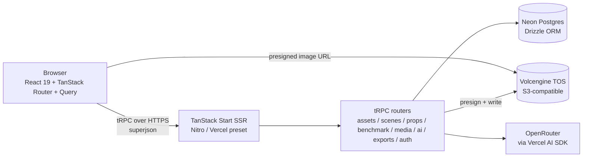
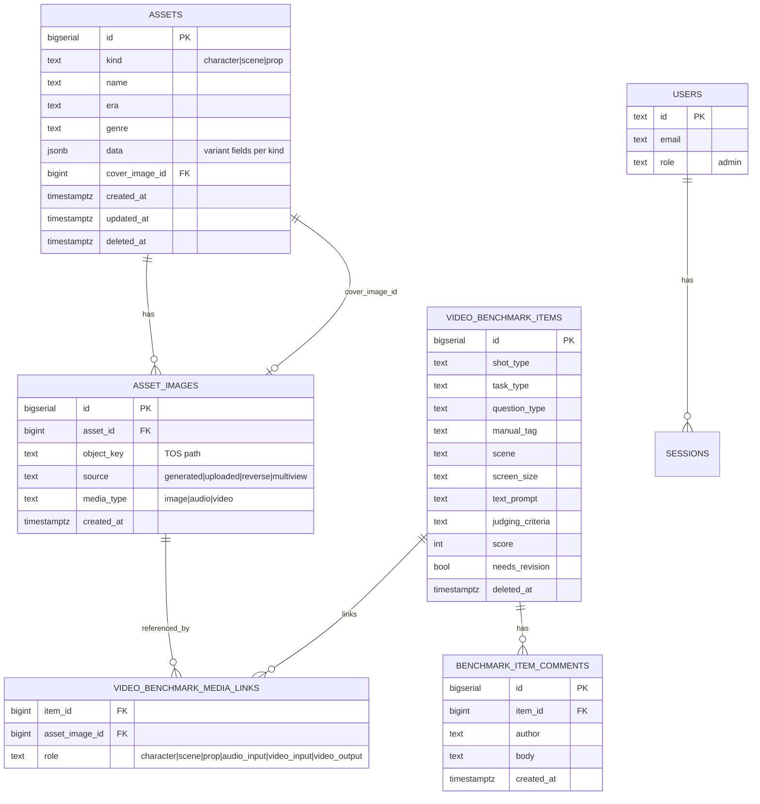
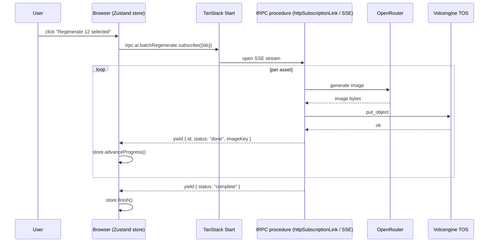
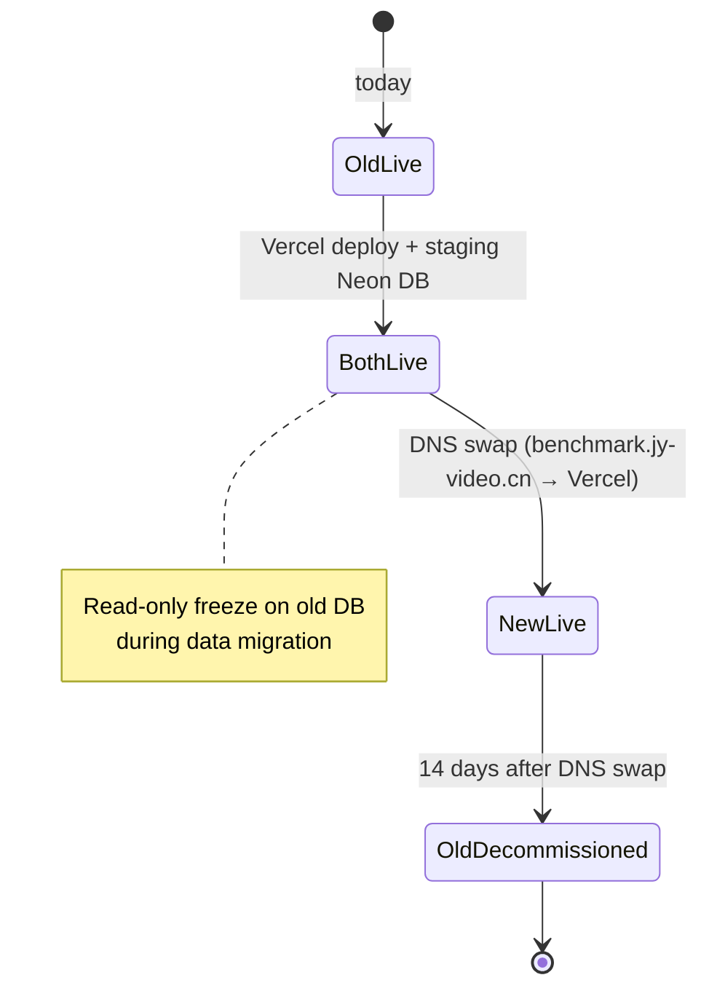

# Asset Library Stack Rebuild

**Target repo:** new project (suggested name `asset-library-next` — final name TBD). All file paths in this plan are repo-relative to that new project, not to the current `benchmark-repo`.

## Summary

Rewrite the 角色与场景资产库 (Character & Scene Asset Library) from FastAPI + React/AntD on a single VM onto the yose-chat blueprint: a pnpm monorepo with TanStack Start + tRPC v11 + Drizzle + Neon + Vercel AI SDK on Vercel. Every existing feature across the four asset types (character, scene, prop, video benchmark) is preserved. Data migrates once to a fresh Neon database; TOS object keys are reused as-is. The current Python app stays running until a DNS swap at the end.

---

## Problem Frame

The current app works, but four properties make every change expensive:

- **Stack drift from the team's preferred patterns.** The yose-chat playbook (TanStack Start, tRPC, Drizzle, Zustand, coss UI, Vercel AI SDK) is now the reference architecture across other projects. The asset library is the lone holdout on FastAPI + React-hooks-only + AntD.
- **No type safety across the wire.** Pydantic on the server, hand-typed `types.ts` on the client. Field shapes drift silently — a JSONB key rename ships without a compile error.
- **All ~40 routes live in `backend/main.py`.** Single-file growth pattern; module boundaries are implicit.
- **Operations are manual and bespoke.** Single VM, hand-rolled `deploy/deploy-remote.sh`, systemd unit, Nginx + certbot + htpasswd config that is not in version control as code. No CI, no tests.

The rebuild fixes all four by adopting the playbook: schema-derived types end-to-end, tRPC routers split per resource, serverless deploy via Vercel, Vitest + PGlite on day one, Biome instead of ad-hoc lint.

---

## High-Level Technical Design

### Runtime architecture



The browser only talks to two endpoints in normal operation: TanStack Start (which mounts tRPC at `/api/trpc/*`) and TOS directly via presigned URLs. AI calls and TOS writes happen server-side.

### Data model



This is the **hybrid** modeling decision (KTD-1): `kind`, `name`, `era`, `genre` get promoted to columns because they appear in every asset type and drive filters; everything else stays in `data` JSONB. Drizzle-zod generates the base row type, and we layer a Zod discriminated union (`character | scene | prop`) on top of `data` so each variant carries its own field shape.

### Long-running operation flow (batch regenerate / export)



Streaming a tRPC subscription keeps progress visible without a queue. The `maxDuration` setting on the Vercel function caps the run; if a batch exceeds it, the client resumes the unfinished IDs in a follow-up subscription. There is no shared mutable state on the server — each yielded item is durable in DB the moment it's emitted.

### Cutover



---

## Output Structure

```
asset-library-next/
├── apps/
│   └── web/
│       ├── src/
│       │   ├── routes/                # TanStack Router file-based routes
│       │   │   ├── __root.tsx
│       │   │   ├── index.tsx          # redirect → /characters
│       │   │   ├── login.tsx
│       │   │   ├── (assets)/
│       │   │   │   ├── characters.tsx
│       │   │   │   ├── scenes.tsx
│       │   │   │   └── props.tsx
│       │   │   ├── benchmark.tsx
│       │   │   └── api/
│       │   │       ├── $.ts           # tRPC handler catch-all
│       │   │       └── auth/
│       │   │           └── $.ts       # better-auth handler
│       │   ├── components/
│       │   │   ├── asset-library/
│       │   │   ├── drawers/
│       │   │   ├── benchmark/
│       │   │   └── ui/                # coss UI (generated, don't edit)
│       │   ├── lib/
│       │   │   ├── trpc.ts
│       │   │   └── auth-client.ts
│       │   ├── stores/                # zustand stores
│       │   │   └── batch-regenerate.ts
│       │   └── styles/
│       │       └── tailwind.css
│       ├── components.json            # coss UI
│       ├── app.config.ts              # TanStack Start
│       └── vite.config.ts
├── packages/
│   ├── server/
│   │   └── src/
│   │       ├── routers/
│   │       │   ├── assets.ts
│   │       │   ├── scenes.ts
│   │       │   ├── props.ts
│   │       │   ├── benchmark.ts
│   │       │   ├── media-assets.ts
│   │       │   ├── ai.ts
│   │       │   └── exports.ts
│   │       ├── services/
│   │       │   ├── storage/           # TOS / S3 client wrapper
│   │       │   ├── ai/                # Vercel AI SDK adapters + prompt registry
│   │       │   └── exports/           # ZIP + XLSX assembly
│   │       ├── db/
│   │       │   ├── schema.ts
│   │       │   ├── auth.gen.ts        # generated by better-auth CLI
│   │       │   └── index.ts
│   │       ├── auth/
│   │       │   └── index.ts
│   │       ├── trpc/
│   │       │   ├── index.ts           # appRouter export
│   │       │   ├── context.ts
│   │       │   └── procedures.ts      # protected/admin procedure builders
│   │       └── api-handler.ts
│   └── shared/
│       └── src/
│           ├── env.ts                 # @t3-oss/env-core
│           ├── schemas/
│           │   ├── assets.ts          # Zod discriminated union
│           │   ├── benchmark.ts
│           │   └── prompts.ts
│           ├── constants/
│           │   ├── orderings.ts       # TYPE_ORDER, GENRE_ORDER, AGE_ORDER
│           │   └── question-types.ts  # cascading shot/task/question hierarchy
│           └── lib/
│               └── prompts/           # 4 character variants + scene + prop
├── drizzle/
│   ├── migrations/                    # generated by drizzle-kit
│   └── seed.ts                        # 76 characters + 55 scenes + props
├── tools/
│   └── migrate-from-legacy/           # one-shot Python→Neon data migration
├── pnpm-workspace.yaml
├── .npmrc                             # node-linker=hoisted
├── tsconfig.base.json
├── biome.json
├── vitest.config.ts
├── drizzle.config.ts
└── .husky/pre-commit
```

---

## Requirements

### Asset CRUD and filtering

- R1. Character, scene, and prop assets each support create / read / update / soft-delete / restore.
- R2. List queries support multi-dimensional filters per asset type — character (era, type, gender, age, genre), scene (era, scene_type, genre, mood), prop (category) — plus 300ms-debounced free-text search across `name` and `data`.
- R3. Filter and search state lives in the URL so views are shareable and survive reload.
- R4. The deleted-only view is a toggle on each list page.
- R5. Per-asset cover image can be set from any image attached to the asset.

### AI features

- R6. Each asset type supports `generatePrompt` — turn structured fields into a model-ready prompt.
- R7. Each asset type supports `extractFields` — parse a freeform description into structured fields.
- R8. Each asset type supports `generateImage` — produce a new image, store it in TOS, attach it to the asset.
- R9. Character prompt generation honors four system-prompt variants (human / animal / creature / anthro); scene generation supports image-to-image variants (reverse-shot, 4-view).

### Media and storage

- R10. All images, audio, and video live in TOS; the database stores only object keys.
- R11. The client receives short-lived presigned TOS URLs (1 hour) for read access; the server never proxies image bytes.
- R12. The unified `mediaAssets` query lists images / audio / video across all asset kinds with dedup-by-`object_key`.

### Video benchmark

- R13. `videoBenchmarkItems` support create / read / update / soft-delete with the same filter pattern as assets, plus the cascading `shot_type → task_type → question_type` hierarchy.
- R14. Each item links to multiple media assets via roles: character images (many), scene images (many), prop images (many), audio input (one), video input (one), video output (one).
- R15. Items carry score, manual tag, and needs-revision flag; the comments thread per item supports add and delete.
- R16. Stats dashboard groups by `(shot_type, question_type)` with counts.

### Export and batch operations

- R17. ZIP export per asset type respects active filters and search; output contains one XLSX manifest and the original images.
- R18. Batch regenerate accepts a list of asset IDs, streams per-item progress to the client, and is resumable on stream interruption.

### Auth

- R19. The app sits behind a single admin login backed by better-auth (email + password). All tRPC procedures except `auth.*` and `health` require a session.

### Migration and cutover

- R20. A one-shot script migrates every row from the existing Neon DB into the new schema. TOS object keys are copied verbatim — image bytes are not re-uploaded.
- R21. The cutover is staged: deploy new app to Vercel against a staging copy of the DB → freeze writes on the old app → run migration → DNS swap.
- R22. Rollback is reversible within 24 hours of cutover by flipping DNS back; the old DB is left untouched for 14 days.

### Quality and ops

- R23. Vitest projects exist for `web`, `server`, and `shared` from day one; server tests use PGlite with migrations applied at boot.
- R24. Biome formats and lints on pre-commit via husky + lint-staged.
- R25. Health endpoint reports DB, TOS, and AI connectivity.

---

## Key Technical Decisions

- **KTD-1. Hybrid schema (typed columns + JSONB) for asset types.** Promote the four fields that every kind uses and every filter touches (`kind`, `name`, `era`, `genre`) to columns; keep variant fields in `data` JSONB. Drizzle-zod derives the base row type; a Zod discriminated union (`{ kind: "character", ... } | { kind: "scene", ... } | { kind: "prop", ... }`) layers on top of `data`. Pure typed columns would force a separate table per kind and lose the shared `AssetLibrary` UI; pure JSONB sacrifices the playbook's single-source-of-truth rule. Hybrid is the smallest deviation from both.

- **KTD-2. Fresh Neon DB, one-shot SQL migration.** The current schema has 13 incremental migrations and naming inconsistencies (e.g., `media_type` added late). Designing the Drizzle schema cleanly and migrating once is cheaper than carrying every legacy quirk forward. The one-shot is a Drizzle script (TypeScript, runs against both DBs) — not raw SQL — so it can validate Zod shapes during the copy and surface bad rows early.

- **KTD-3. Single-admin auth via better-auth.** Mirrors current Basic Auth behavior (one shared login, no per-user data). Uses better-auth's email+password plugin, no plugins for admin/phoneNumber/OTP. Extending to multi-user later is additive — add the `admin()` plugin and a `role` column. We pick better-auth (not raw cookies) for parity with other team projects and to get session management for free.

- **KTD-4. SSE-streamed tRPC subscriptions for long-running ops; no queue.** Vercel functions allow up to 300s on Pro; batch regen with ~30s per image gets ~10 items per stream. The client orchestrates resumption for larger batches. Adding Inngest or Trigger.dev is the right escape valve later, but introducing it now costs infra setup without buying anything the streamed approach can't deliver. Recorded as a Risk (see Risk Analysis) so the next reviewer sees the trade.

- **KTD-5. Direct TOS presigned URLs handed to the client at query time.** Saves a Vercel function invocation per image and avoids the cold-start penalty on the proxy hop. The downside is exposing `*.volces.com` in the network panel; acceptable for an internal admin tool. The current `/images/{key}` redirect is replaced by `getPresignedUrl()` returning the signed URL inside each asset payload, with a 1-hour TTL.

- **KTD-6. tRPC v11, never TanStack Start `createServerFn`.** Per playbook §3 ("Always tRPC, never TanStack Start server functions"). Gives isomorphic client + vanilla caller in one type system; vanilla caller is needed inside Zustand actions (batch regenerate).

- **KTD-7. Vercel AI SDK v6 + `@openrouter/ai-sdk-provider`.** Keeps the existing OpenRouter API key working; standardizes on a single SDK for both text and image. For image generation we use `experimental_generateImage` from `ai` v6 with the OpenRouter provider — current model `gpt-5.4-image-2` continues to work through OpenRouter's image endpoint.

- **KTD-8. drizzle-zod as the single source of truth.** Every Zod schema in `packages/shared/src/schemas/` either comes from `createInsertSchema()` / `createSelectSchema()` on a Drizzle table, or extends one of those. No hand-written shapes that mirror a DB column.

- **KTD-9. nuqs for filter and search state in URLs.** Replaces the localStorage tab-selection pattern in the current app. Bookmarks and share-links work; back/forward navigation works; deep linking to a filtered view becomes free.

- **KTD-10. TanStack Router file-based routing.** One file per top-level view: `/characters`, `/scenes`, `/props`, `/benchmark`, `/login`. Replaces the segmented-control tab UX with real routes and route-level loaders for the initial list payload.

- **KTD-11. Vitest `test.projects` split from day one.** Even with one project initially per the playbook's §5.7 guidance — keeps the PGlite swap-in trivial later.

---

## Scope Boundaries

In scope: every feature catalogued in this plan's Requirements. Behavior parity is the test — if the current app does X and Requirements list X, the rebuild does X.

### Deferred to Follow-Up Work

- Image upload validation hardening (size, dimension, MIME sniff). The current app trusts the client; we preserve that posture initially.
- Audit logs (who changed what, when).
- Analytics / usage metrics.
- Full-text search beyond ILIKE on `name` and `data`.
- Multi-user roles and per-user permissions (single admin only on day one).
- Replicated TOS / multi-region storage.
- Background job infrastructure (Inngest / Trigger.dev) — only added if batch regen outgrows SSE.

### Outside this product's identity

- Any feature not present in the current app. The rebuild is a stack migration, not a product evolution.
- Public-facing UI; this remains an internal admin tool.
- Mobile clients.

---

## Implementation Units

Units group into five phases by dependency. Each phase should land before the next begins because later phases assume earlier ones are wired and tested.

### Phase 1 — Foundation

#### U1. Monorepo skeleton and tooling

- **Goal:** stand up the empty monorepo with all the playbook's cross-cutting tooling so every later unit lands into a working dev loop.
- **Requirements:** R24
- **Dependencies:** none
- **Files:**
  - `pnpm-workspace.yaml`
  - `.npmrc`
  - `tsconfig.base.json`
  - `biome.json`
  - `.husky/pre-commit`
  - `package.json` (root, with lint-staged config)
  - `apps/web/package.json`, `packages/server/package.json`, `packages/shared/package.json` (workspace declarations only, no source yet)
- **Approach:** Follow playbook §4 exactly. `node-linker=hoisted` in `.npmrc`. Biome at root with 2-space, 100col, single quotes per playbook §5.9. Husky + lint-staged run `biome format --write` on staged files. Strict `tsconfig` with `noUncheckedIndexedAccess: true` and path aliases (`@/lib/*`, `@/server/*`, `@/constant/*`, `@/env`, `@/*`).
- **Patterns to follow:** stack-playbook.md §3-5 verbatim; yose-chat's root files if accessible.
- **Test scenarios:** Test expectation: none — pure scaffolding, exercised by every later unit.
- **Verification:** `pnpm install`, `pnpm lint`, `pnpm typecheck` all succeed at the root.

#### U2. App shell — TanStack Start + Nitro + Tailwind + coss UI

- **Goal:** boot a hello-world page served by TanStack Start on Vite, deployable to Vercel, with Tailwind v4 and coss UI ready to use.
- **Requirements:** R23 (Vitest projects), R24
- **Dependencies:** U1
- **Files:**
  - `apps/web/app.config.ts`
  - `apps/web/vite.config.ts`
  - `apps/web/src/routes/__root.tsx`
  - `apps/web/src/routes/index.tsx`
  - `apps/web/src/styles/tailwind.css`
  - `apps/web/components.json` (coss UI config)
  - `vitest.config.ts` at root with `test.projects` declaration for `web`, `server`, `shared`
- **Approach:** Plugin order in `vite.config.ts` per playbook §5.1: `tsConfigPaths` → `tanstackStart()` → `nitro({ preset: 'vercel' })` → `viteReact()` → `tailwindcss()`. Initialize coss UI per playbook §5.6 (read `coss.com/ui/llms.txt` first, don't reach for shadcn patterns). Add a single dummy button to prove the design system works.
- **Patterns to follow:** stack-playbook.md §5.1 and §5.6 verbatim.
- **Test scenarios:**
  - Happy path: `pnpm --filter web dev` serves the root page; vitest `web` project boots and runs a smoke test asserting `__root.tsx` renders without errors.
- **Verification:** root page renders in the browser; smoke test passes.

#### U3. tRPC v11 + TanStack Query + superjson wiring

- **Goal:** end-to-end typed RPC call from the browser to the server with `superjson` transport, mounted as a TanStack Start catch-all.
- **Requirements:** baseline for every server-side R.
- **Dependencies:** U2
- **Files:**
  - `packages/server/src/trpc/index.ts` (`appRouter` export with one `health` procedure)
  - `packages/server/src/trpc/context.ts`
  - `packages/server/src/trpc/procedures.ts` (publicProcedure, protectedProcedure stubs)
  - `packages/server/src/api-handler.ts`
  - `apps/web/src/routes/api/$.ts`
  - `apps/web/src/lib/trpc.ts` (client + vanilla caller via `createClientCaller()`)
- **Approach:** Per playbook §5.2. Export `AppRouter` type from the server entry; client imports the type only. Vanilla caller (`trpcClient`) for use inside Zustand actions later. `superjson` transformer on both ends. Health procedure returns `{ ok: true, ts: Date }` so the Date round-trips through superjson and confirms the transformer.
- **Test scenarios:**
  - Happy path (server): calling `appRouter.createCaller(...).health()` returns `{ ok: true, ts: <Date instance> }`.
  - Integration: a React component using `trpc.health.useQuery()` renders the timestamp; PGlite not required since this procedure touches no DB.
- **Verification:** RPC works in browser; query devtools shows the request; `Date` arrives as a `Date`.

#### U4. Env validation + Neon driver setup

- **Goal:** every env var validated at boot via `@t3-oss/env-core`; Neon serverless client connected.
- **Requirements:** baseline for R10, R19.
- **Dependencies:** U1
- **Files:**
  - `packages/shared/src/env.ts`
  - `packages/server/src/db/index.ts` (configured Drizzle client with Neon HTTP driver — no schema yet)
  - `.env.example` at root
- **Approach:** Per playbook §5.8. Server-only vars: `DATABASE_URL`, `OPENROUTER_API_KEY`, `TOS_BUCKET`, `TOS_REGION`, `TOS_ENDPOINT`, `TOS_ACCESS_KEY_ID`, `TOS_SECRET_ACCESS_KEY`, `BETTER_AUTH_SECRET`. Client vars (none yet — UI text is all in-bundle). `runtimeEnv: process.env`. Drizzle client uses `@neondatabase/serverless` HTTP-based driver per playbook §5.3.
- **Test scenarios:**
  - Happy path: env loads with all required vars; `db.execute(sql\`select 1\`)` returns 1.
  - Error path: missing `DATABASE_URL` causes module-load to throw before any handler runs.
- **Verification:** boot fails fast on missing env; `db` connects to Neon.

### Phase 2 — Data layer

#### U5. Drizzle schema — assets, asset_images, auth tables

- **Goal:** the full asset-side schema in Drizzle, with relations, soft-delete columns, and the discriminated-union Zod schema layered on `data`.
- **Requirements:** R1, R2, R4, R5, R10, R19
- **Dependencies:** U4
- **Files:**
  - `packages/server/src/db/schema.ts` (assets, assetImages tables; `cover_image_id` self-FK pattern)
  - `packages/server/src/db/auth.gen.ts` (generated by `npx @better-auth/cli generate`; never hand-edit per playbook §5.4)
  - `packages/shared/src/schemas/assets.ts` (drizzle-zod-derived base + discriminated union on `data`)
  - `packages/shared/src/constants/orderings.ts` (TYPE_ORDER, GENRE_ORDER, AGE_ORDER carried verbatim from current `backend/db.py`)
  - `drizzle.config.ts`
  - `drizzle/migrations/0001_initial.sql` (generated by `pnpm db:gen`)
- **Approach:**
  - `assets` table: `id bigserial PK`, `kind text`, `name text`, `era text NULL`, `genre text NULL`, `data jsonb NOT NULL`, `cover_image_id bigint NULL`, `created_at`, `updated_at`, `deleted_at timestamptz NULL`.
  - GIN index on `data`, btree on `(kind, deleted_at)`, btree on `(kind, era)`, btree on `(kind, genre)`.
  - Per-kind Zod variant defines what `data` looks like: `CharacterDataSchema { type, gender, age, persona, body, features, prompt, description }`, `SceneDataSchema { scene_type, mood, elements, prompt, description }`, `PropDataSchema { category, prompt, description }`.
  - `AssetSchema = z.discriminatedUnion('kind', [CharacterAssetSchema, SceneAssetSchema, PropAssetSchema])` where each variant combines the base row Zod with the variant `data` Zod.
- **Technical design (directional):**
  ```ts
  // packages/server/src/db/schema.ts — directional, not the final file
  export const assets = pgTable('assets', {
    id: bigserial('id', { mode: 'number' }).primaryKey(),
    kind: text('kind').$type<'character' | 'scene' | 'prop'>().notNull(),
    name: text('name').notNull(),
    era: text('era'),
    genre: text('genre'),
    data: jsonb('data').notNull(),
    coverImageId: bigint('cover_image_id', { mode: 'number' }),
    createdAt: timestamp('created_at', { withTimezone: true }).defaultNow().notNull(),
    updatedAt: timestamp('updated_at', { withTimezone: true }).defaultNow().notNull(),
    deletedAt: timestamp('deleted_at', { withTimezone: true }),
  })
  ```
- **Test scenarios:**
  - Happy path: insert + select round-trips through Drizzle for a character; the parsed result satisfies `CharacterAssetSchema`.
  - Edge: insert with `data` shape that violates `CharacterDataSchema` (e.g., missing `prompt`) — fails Zod parse at the service boundary, never reaches DB.
  - Soft-delete: setting `deleted_at` excludes the row from the default list query but a `deletedOnly: true` flag re-includes it.
- **Verification:** `pnpm db:gen` produces a clean migration; `pnpm db:migrate` runs against PGlite without error.

#### U6. Drizzle schema — video benchmark tables

- **Goal:** video benchmark items, media link table, and comments table — schema complete.
- **Requirements:** R13, R14, R15, R16
- **Dependencies:** U5
- **Files:**
  - `packages/server/src/db/schema.ts` (extended)
  - `packages/shared/src/schemas/benchmark.ts`
  - `packages/shared/src/constants/question-types.ts` (cascading shot_type → task_type → question_type, carried verbatim from current `frontend/src/data/questionTypeOptions.ts`)
- **Approach:**
  - `videoBenchmarkItems` carries all scalar fields including `score int`, `needsRevision bool`, `manualTag text`, `judgingCriteria text`, `deletedAt timestamptz NULL`.
  - `videoBenchmarkMediaLinks` is a 3-column link: `itemId`, `assetImageId`, `role`. Compound PK on `(itemId, assetImageId, role)` so the same image can fill two roles on the same item without duplication.
  - `benchmarkItemComments` carries `author text` (from session at insert time), `body text`, `createdAt`.
  - Indexes: `(shot_type, question_type)` for the stats dashboard; `(deletedAt)` for the default list filter.
- **Test scenarios:**
  - Happy path: insert item + link 3 character images + 1 scene image + 1 video output; load the item with `with: { mediaLinks: true }` and confirm all 5 links present.
  - Edge: linking the same image twice in the same role fails the PK constraint; linking the same image twice in different roles succeeds.
- **Verification:** migration applies cleanly; relation loaders return shapes that satisfy `VideoBenchmarkItemSchema`.

#### U7. Storage layer — TOS via S3 client with presigned URLs

- **Goal:** TS equivalent of the current `backend/storage.py`: `putObject`, `getPresignedUrl`, `deleteObject`, `newObjectKey`.
- **Requirements:** R10, R11
- **Dependencies:** U4
- **Files:**
  - `packages/server/src/services/storage/index.ts`
  - `packages/server/src/services/storage/__tests__/storage.test.ts`
- **Approach:** Use `@aws-sdk/client-s3` configured against the TOS endpoint (Volcengine is S3-compatible). `getPresignedUrl()` uses `@aws-sdk/s3-request-presigner` with a 1-hour expiry. `newObjectKey(ext, prefix)` mirrors the current crypto-random UUID v4 + extension pattern. Prefixes: `images/`, `audios/`, `videos/`.
- **Test scenarios:**
  - Happy path: `putObject(key, bytes)` then `getPresignedUrl(key)` returns a URL whose GET succeeds and returns the same bytes.
  - Edge: `getPresignedUrl()` for a non-existent key still returns a signed URL (S3 contract) — caller is responsible for confirming the object exists.
  - Error path: invalid bucket → `putObject` rejects with a typed error; the AI router (U13) maps this to a user-visible message instead of letting the raw AWS error bubble.
- **Verification:** integration test using TOS staging bucket passes; unit tests mock S3 client via `aws-sdk-client-mock`.

### Phase 3 — Server layer

#### U8. better-auth setup — single admin

- **Goal:** email+password auth with sessions, mounted at `/api/auth/$`, no plugins beyond email+password.
- **Requirements:** R19
- **Dependencies:** U5
- **Files:**
  - `packages/server/src/auth/index.ts`
  - `apps/web/src/routes/api/auth/$.ts`
  - `apps/web/src/lib/auth-client.ts`
  - `packages/server/src/trpc/context.ts` (extend to read session)
  - `packages/server/src/trpc/procedures.ts` (`protectedProcedure` checks session)
- **Approach:** Per playbook §5.4. better-auth reads/writes the same Drizzle client; generated tables come from `npx @better-auth/cli generate` and land in `auth.gen.ts`. Context derives `session` from cookies; `protectedProcedure` throws `UNAUTHORIZED` if absent. Seed script inserts the first admin user from env-provided credentials.
- **Test scenarios:**
  - Happy path: sign-in with seed credentials → cookie set → subsequent `protectedProcedure` call succeeds.
  - Error: `protectedProcedure` without cookie → `UNAUTHORIZED`; expired session → re-login required.
- **Verification:** server tests in `packages/server/src/auth/__tests__/auth.test.ts` cover happy + unauthorized.

#### U9. AI service — Vercel AI SDK + OpenRouter, prompt registry

- **Goal:** one AI module with `generateText`, `generateImage`, `extractFields` callable from any tRPC procedure; system prompts centralized.
- **Requirements:** R6, R7, R8, R9
- **Dependencies:** U7
- **Files:**
  - `packages/server/src/services/ai/index.ts`
  - `packages/server/src/services/ai/openrouter.ts` (provider instance via `@openrouter/ai-sdk-provider`)
  - `packages/shared/src/lib/prompts/character.ts` (human, animal, creature, anthro variants)
  - `packages/shared/src/lib/prompts/scene.ts`
  - `packages/shared/src/lib/prompts/prop.ts`
  - `packages/shared/src/lib/prompts/extract-fields.ts`
  - `packages/server/src/services/ai/__tests__/ai.test.ts`
- **Approach:**
  - Provider: `createOpenRouter({ apiKey: env.OPENROUTER_API_KEY, baseURL: env.OPENROUTER_BASE_URL })`.
  - Text: `generateText({ model: openrouter('anthropic/claude-opus-4.7'), system, prompt })`.
  - Image: `experimental_generateImage({ model: openrouter.image('openai/gpt-5.4-image-2'), prompt, ... })` — the result `.image` is bytes that we pipe to `storage.putObject()`.
  - Extract: structured-output via `generateObject({ schema: Zod schema for variant fields })`.
  - System prompts live in `packages/shared/src/lib/prompts/` mirroring the current 4 character variants verbatim. Variant selection is by `data.type` for characters; scene/prop use one prompt each.
- **Technical design (directional):**
  ```ts
  // packages/server/src/services/ai/index.ts — directional
  export async function generateCharacterPrompt(input: CharacterInput): Promise<string> {
    const variant = pickCharacterVariant(input.type) // human|animal|creature|anthro
    const system = CHARACTER_PROMPTS[variant]
    const { text } = await generateText({ model: textModel(), system, prompt: serialize(input) })
    return text
  }
  ```
- **Test scenarios:**
  - Happy path (mocked provider): each of the 4 character variants returns a non-empty string when called with a matching input shape.
  - Happy path: `extractFields` for a sample description returns a `CharacterDataSchema`-shaped object.
  - Error: provider rate-limit response surfaces as a typed `AI_RATE_LIMITED` error the router can map to a 429.
- **Verification:** AI tests pass with mocked `ai` SDK; manual smoke against staging OpenRouter key returns real content.

#### U10. assetsRouter (shared CRUD for character / scene / prop)

- **Goal:** one router that powers list / get / create / update / delete / restore for all three asset kinds, plus image attach / detach / set-cover.
- **Requirements:** R1, R2, R3, R4, R5
- **Dependencies:** U5, U7, U8
- **Files:**
  - `packages/server/src/routers/assets.ts`
  - `packages/server/src/routers/__tests__/assets.test.ts`
- **Approach:**
  - Input schemas: `list({ kind, filters, search, deletedOnly, cursor })`, `get({ id })`, `create({ kind, ...input })`, `update({ id, ...input })`, `delete({ id })`, `restore({ id })`, `attachImage({ id, objectKey, source })`, `deleteImage({ imageId })`, `setCover({ id, imageId })`.
  - List uses cursor-based pagination per playbook §3 ("Never offset"); cursor = `id` of the last row, ordering by `id desc`.
  - Asset response always includes `images` array and each image carries a `url` field — the presigned URL computed at query time.
  - Filter application is dynamic per kind: characters filter on `era, type, gender, age, genre`; scenes on `era, scene_type, genre, mood`; props on `category`.
- **Test scenarios:**
  - Happy path: create a character → list → get returns the row with the variant `data` shape correctly typed.
  - Filters: insert 5 characters with mixed `era` and `genre`; list with `{ era: ["古代"] }` returns only the matching subset.
  - Pagination: insert 25 rows; first page returns 20 + cursor; second page returns 5.
  - Soft delete: delete → list (default) excludes the row → list with `deletedOnly: true` includes it → restore returns it to default list.
  - Cover: attach 2 images → set the second as cover → response shows `coverImageId` matches.
- **Verification:** all scenarios pass against PGlite; cursor semantics match what the client sends.

#### U11. scenesRouter and propsRouter extensions

- **Goal:** scene `generateView` (reverse-shot, 4-view) and any prop-specific behavior.
- **Requirements:** R9
- **Dependencies:** U9, U10
- **Files:**
  - `packages/server/src/routers/scenes.ts`
  - `packages/server/src/routers/props.ts`
  - `packages/server/src/routers/__tests__/scenes.test.ts`
- **Approach:**
  - `scenes.generateView({ id, mode: "reverse" | "multiview" })` reads the cover image bytes from TOS, calls the image-to-image generation via Vercel AI SDK (`experimental_generateImage` with `images` input), uploads the result with `source: mode`, and attaches it.
  - Props are otherwise covered by `assetsRouter` — `propsRouter` is mostly empty initially but reserved for future prop-only operations.
- **Test scenarios:**
  - Happy path (mocked): `generateView({ mode: "reverse" })` calls AI with the cover image bytes, gets back new bytes, persists with `source: "reverse"`.
  - Error: scene without a cover image → `BAD_REQUEST` "Set a cover image first."
- **Verification:** tests pass with mocked AI + storage.

#### U12. videoBenchmarkRouter

- **Goal:** all benchmark item operations including stats and comments.
- **Requirements:** R13, R14, R15, R16
- **Dependencies:** U6, U8, U10
- **Files:**
  - `packages/server/src/routers/benchmark.ts`
  - `packages/server/src/routers/__tests__/benchmark.test.ts`
- **Approach:**
  - Procedures: `list`, `get`, `create`, `update`, `delete`, `restore`, `setNeedsRevision`, `stats`, `comments.list`, `comments.add`, `comments.delete`.
  - Stats returns `{ shotType, questionType, count }[]` via a `GROUP BY` query.
  - Create / update accept the full media-link bundle (`{ characterImageIds, sceneImageIds, propImageIds, audioInputId, videoInputId, videoOutputId }`); router upserts links transactionally inside `db.transaction()` per playbook §3.
  - Comments use the authenticated user's email as `author`.
- **Test scenarios:**
  - Happy path: create item with 3 character + 1 scene + 1 video → load → all 5 links present and grouped by role on the response.
  - Stats: insert 10 items across 2 shot_types × 2 question_types → stats returns 4 rows with correct counts.
  - Comment delete: only the comment author or admin can delete (single admin satisfies both for now).
- **Verification:** tests pass; transaction rollback on link-insert failure leaves item un-created.

#### U13. mediaAssetsRouter + ai router + exports router

- **Goal:** the remaining three routers — unified media listing, AI procedures wired to the AI service, and the export endpoint.
- **Requirements:** R6, R7, R8, R12, R17
- **Dependencies:** U9, U10, U11, U12
- **Files:**
  - `packages/server/src/routers/media-assets.ts`
  - `packages/server/src/routers/ai.ts`
  - `packages/server/src/routers/exports.ts`
  - `packages/server/src/services/exports/index.ts`
  - `packages/server/src/routers/__tests__/exports.test.ts`
- **Approach:**
  - `mediaAssetsRouter.list({ kind?, mediaType?, dedup })`: joins `asset_images` to `assets`, optionally dedups by `object_key`, returns presigned URLs.
  - `mediaAssetsRouter.upload`: tRPC procedure accepting `{ kind, file: base64 | FormData }`. Inserts the image row + uploads to TOS in a single transaction (the TOS write happens first; on insert failure, schedule a deferred delete to avoid leaking objects — recorded as a Risk).
  - `aiRouter.generatePrompt({ kind, input })`, `extractFields({ kind, description })`, `generateImage({ kind, id, prompt, refImage?, aspectRatio? })`. Each maps to the matching AI service function and persists results.
  - `exportsRouter.exportZip({ kind, filters, search })`: returns a `ReadableStream` via tRPC's `streamResponse` (raw HTTP), assembled with `archiver` (ZIP) + `exceljs` (XLSX). Streaming avoids buffering hundreds of MB in a Vercel function.
- **Technical design (directional):**
  ```ts
  // packages/server/src/services/exports/index.ts — directional
  export async function* streamAssetExport(rows: Asset[]): AsyncIterable<Uint8Array> {
    const archive = archiver('zip')
    const xlsx = await buildXlsxBuffer(rows)
    archive.append(xlsx, { name: `${kind}-manifest.xlsx` })
    for (const row of rows) {
      for (const img of row.images) {
        const bytes = await tosGet(img.objectKey)
        archive.append(bytes, { name: `images/${row.id}/${img.id}.png` })
      }
    }
    archive.finalize()
    yield* archive
  }
  ```
- **Test scenarios:**
  - Media list: 3 assets with shared images dedup to fewer rows; without dedup returns all rows.
  - Export ZIP: list of 5 assets → resulting ZIP contains the XLSX + 1 image per row + correct row count in the XLSX.
  - AI procedures: each delegates to the service module mocked at the boundary.
- **Verification:** export ZIP opens cleanly in a real ZIP tool; XLSX opens in Excel; image files inside are intact PNGs.

#### U14. AI batch regenerate + export progress as tRPC subscriptions (SSE)

- **Goal:** the long-running operations expose a subscription that streams per-item progress so the client can render a progress bar without polling.
- **Requirements:** R17, R18
- **Dependencies:** U13
- **Files:**
  - `packages/server/src/routers/ai.ts` (extended with `batchRegenerate` subscription)
  - `packages/server/src/routers/exports.ts` (extended with `exportZipStream` subscription)
  - `packages/server/src/routers/__tests__/ai-batch.test.ts`
  - `apps/web/src/lib/trpc.ts` (configure `httpSubscriptionLink` for SSE)
  - `apps/web/app.config.ts` (`maxDuration: 300` on Vercel for the streaming function)
- **Approach:**
  - Subscription emits `{ id, status: "pending" | "done" | "failed", imageKey?, error? }` per item.
  - Resumption contract: client retains a `Set<id>` of completed items; on stream end without `status: "complete"`, client invokes the subscription again with the remaining IDs.
  - Each item's DB write happens before the yield, so server crashes don't lose work — the next subscription call sees the persisted row and skips it.
- **Test scenarios:**
  - Happy path: subscribe with 3 IDs → 3 yields with `status: "done"` followed by `status: "complete"`.
  - Resumption: 5 IDs, force-fail after 2 → second subscription with the remaining 3 IDs completes them.
  - Per-item failure: 1 of 3 fails → yield includes `status: "failed", error`; other 2 succeed; subscription completes without throwing.
- **Verification:** UI consumer in U20 renders progress against a real subscription end-to-end.

### Phase 4 — Frontend

#### U15. TanStack Router route tree + root layout + auth UI

- **Goal:** five top-level routes wired, root layout with nav, login page.
- **Requirements:** R19; baseline for R1, R13
- **Dependencies:** U8
- **Files:**
  - `apps/web/src/routes/__root.tsx` (layout shell with nav + auth guard)
  - `apps/web/src/routes/index.tsx` (redirect → `/characters`)
  - `apps/web/src/routes/login.tsx`
  - `apps/web/src/routes/(assets)/characters.tsx`, `scenes.tsx`, `props.tsx` (placeholders)
  - `apps/web/src/routes/benchmark.tsx` (placeholder)
  - `apps/web/src/lib/auth-client.ts`
- **Approach:** Root layout reads session via `auth-client.ts`; unauthenticated → redirect to `/login`. Nav uses coss UI nav primitives, mirrors the current segmented control with router-link semantics.
- **Test scenarios:**
  - Happy path: unauthenticated visit to `/characters` → redirect to `/login`; sign in → land on `/characters`.
  - Edge: sign out from anywhere → return to `/login`.
- **Verification:** all five routes navigate; auth guard works.

#### U16. Shared AssetLibrary primitives

- **Goal:** the reusable list/grid + filter + lazy-image primitives that all three asset routes consume.
- **Requirements:** R1, R2, R3, R5
- **Dependencies:** U10, U15
- **Files:**
  - `apps/web/src/components/asset-library/AssetLibrary.tsx`
  - `apps/web/src/components/asset-library/FilterPanel.tsx`
  - `apps/web/src/components/asset-library/AssetCard.tsx`
  - `apps/web/src/components/asset-library/LazyImage.tsx`
  - `apps/web/src/components/asset-library/useFilters.ts` (nuqs-backed URL state)
  - `apps/web/src/components/asset-library/__tests__/AssetLibrary.test.tsx`
- **Approach:**
  - `useFilters()` returns `{ filters, search, deletedOnly, setFilter, setSearch }`, all backed by nuqs (`useQueryState`) per playbook §3.
  - `AssetLibrary<T extends Asset>` is a generic over the asset kind; takes `kind` + `filterFields` + `renderCard` and handles list query, infinite scroll via TanStack Query, drawer state.
  - `LazyImage` uses native `loading="lazy"` first; falls back to IntersectionObserver if a placeholder needs custom render.
  - Search debouncing via `use-debounce`.
- **Test scenarios:**
  - Happy path: render with mocked tRPC client returning 3 assets → 3 cards render with lazy-image src set.
  - URL sync: setting a filter updates the URL; reload preserves the filter state.
  - Empty state: list returns 0 → renders "no results" coss UI empty primitive.
- **Verification:** smoke test renders without errors; manual check confirms URL stays in sync.

#### U17. Per-asset drawer forms

- **Goal:** Character, Scene, Prop create/edit drawers — each with form, AI tool buttons (generate prompt, extract fields, generate image), image grid.
- **Requirements:** R5, R6, R7, R8, R9
- **Dependencies:** U13, U16
- **Files:**
  - `apps/web/src/components/drawers/CharacterDrawer.tsx`
  - `apps/web/src/components/drawers/SceneDrawer.tsx`
  - `apps/web/src/components/drawers/SceneViewColumn.tsx`
  - `apps/web/src/components/drawers/PropDrawer.tsx`
  - `apps/web/src/components/drawers/shared/AiToolbar.tsx`
  - `apps/web/src/components/drawers/__tests__/CharacterDrawer.test.tsx`
- **Approach:**
  - Forms use `react-hook-form` + `@hookform/resolvers/zod` with the variant Zod schemas from `packages/shared/src/schemas/assets.ts`.
  - AI buttons call the tRPC procedures and patch the form with the result (`form.setValue`).
  - `SceneViewColumn` renders reverse/multiview thumbnails and exposes a "generate view" button per mode.
  - Image grid uses coss UI Card primitives; "Set as cover" calls `assets.setCover`.
- **Test scenarios:**
  - Happy path: edit a character, click "Generate prompt", form `prompt` field populates with the AI response.
  - Validation: submit with missing `name` → Zod resolver surfaces field error inline; submit blocked.
  - Set cover: click on a non-cover image → cover swaps; UI reflects new cover immediately via optimistic update.
- **Verification:** all three drawers open from their respective list pages; round-trip create/edit works.

#### U18. Video benchmark page

- **Goal:** complete benchmark page — list with cascading filters, drawer with multi-role media picker, comments thread, stats dashboard.
- **Requirements:** R13, R14, R15, R16
- **Dependencies:** U12, U17
- **Files:**
  - `apps/web/src/routes/benchmark.tsx`
  - `apps/web/src/components/benchmark/BenchmarkList.tsx`
  - `apps/web/src/components/benchmark/BenchmarkDrawer.tsx`
  - `apps/web/src/components/benchmark/BenchmarkComments.tsx`
  - `apps/web/src/components/benchmark/MediaPicker.tsx`
  - `apps/web/src/components/benchmark/StatsDashboard.tsx`
  - `apps/web/src/components/benchmark/__tests__/BenchmarkDrawer.test.tsx`
- **Approach:**
  - Cascading filters derive their option set from `questionTypeHierarchy` in shared constants — selecting a `shot_type` narrows `task_type` to the matching subset.
  - `MediaPicker` queries `mediaAssetsRouter.list` filtered by role-appropriate kind (character images for the character role, etc.); supports multi-select per role except audio/video (single-select).
  - Comments thread tails the page; new comments optimistically prepend and reconcile on success.
- **Test scenarios:**
  - Cascading filter: select `shot_type = X` → `task_type` dropdown narrows; clearing `shot_type` resets `task_type` to full set.
  - Multi-role link: drawer with 3 character + 2 prop + 1 video saves → reload shows the same selections.
  - Comment add: type + submit → comment appears immediately; on server error, comment removed and toast shown.
- **Verification:** the page works end-to-end; stats dashboard matches inserted data.

#### U19. Batch regenerate + export UI

- **Goal:** Zustand store that drives the SSE consumption, progress UI, export trigger.
- **Requirements:** R17, R18
- **Dependencies:** U14, U16
- **Files:**
  - `apps/web/src/stores/batch-regenerate.ts`
  - `apps/web/src/components/asset-library/BatchToolbar.tsx`
  - `apps/web/src/components/asset-library/__tests__/batch-regenerate.test.ts`
- **Approach:**
  - Store per playbook §5.10: `create(immer(combine({ pending: [], done: [], failed: [] }, (set, get) => ({ update: set, async start(ids) { ... } }))))`.
  - `start()` calls `trpcClient.ai.batchRegenerate.subscribe()` via vanilla caller (Zustand action, not React), iterates yields, calls `useStore.getState().recordResult()` after each `await`.
  - Export button calls `exports.exportZip` which returns a download URL (signed), and triggers `window.location = url` — for small exports — or opens the SSE stream and streams chunks into a Blob via the Fetch API — for larger ones.
- **Test scenarios:**
  - Happy path: store starts with 3 IDs → 3 results recorded → status becomes complete.
  - Resumption: simulate stream end after 2 results → store re-subscribes for the 1 remaining → completes.
  - Per-item failure: 1 of 3 yields failed → store records it in `failed` array; UI shows red badge; retry button re-subscribes only on failures.
- **Verification:** the batch flow runs end-to-end against a real `ai.batchRegenerate` subscription; progress bar advances; failures surface.

### Phase 5 — Migration and cutover

#### U20. Data migration script

- **Goal:** a single Drizzle script that reads from the existing Neon DB (or a snapshot of it) and writes into the new schema. TOS object keys are reused unchanged so no image bytes move.
- **Requirements:** R20
- **Dependencies:** U5, U6
- **Files:**
  - `tools/migrate-from-legacy/migrate.ts`
  - `tools/migrate-from-legacy/__tests__/migrate.test.ts`
  - `tools/migrate-from-legacy/README.md`
- **Approach:**
  - Two Drizzle clients: `legacyDb` against the source DSN, `newDb` against the new DSN.
  - For each legacy asset row: parse via the legacy shape, transform into the new typed-column + JSONB shape, validate against the new Zod variant, insert.
  - For each `asset_images` row: copy verbatim, preserve `object_key`.
  - For `video_benchmark_*`: copy items, then materialize `videoBenchmarkMediaLinks` rows from the legacy `video_input_id` / `video_output_id` columns plus the JSONB media link blob (whatever shape the legacy app used).
  - Idempotent: re-running the script is safe; uses `INSERT ... ON CONFLICT DO NOTHING` keyed on `legacy_id` (a temporary nullable column we add to the new schema for the cutover window only, then drop).
  - Reports unmigrated rows (validation failures) to stderr without halting; final summary counts.
- **Test scenarios:**
  - Happy path: 10 legacy assets → 10 new assets, all parseable.
  - Edge: legacy asset with a `data` shape that violates the new Zod variant → logged + skipped + included in the failure count.
  - Idempotency: run twice → second run inserts zero new rows.
- **Verification:** dry-run on a snapshot of production Neon completes within 30 minutes; failure count fits a one-page report we can review.

#### U21. Vercel deployment + custom domain

- **Goal:** new app reachable at a Vercel preview URL with all env vars configured; staging Neon DB connected; smoke flow works end-to-end.
- **Requirements:** R10, R11, R19
- **Dependencies:** U2, U4, U15
- **Files:**
  - `vercel.json` (project config — `maxDuration` for streaming functions)
  - `apps/web/app.config.ts` (Nitro `vercel` preset already set in U2; this unit confirms the production build emits the right output)
- **Approach:**
  - Vercel project linked to the new repo; production branch `main`, preview branches for PRs.
  - Env vars set in Vercel dashboard from the same values used locally; secrets via Vercel encrypted env.
  - DNS: a temporary `staging.asset-library.<our-domain>` CNAME → Vercel for pre-cutover testing.
- **Test scenarios:** Test expectation: none — purely infrastructure; verified by U22's dress rehearsal.
- **Verification:** preview URL loads, login works, a character round-trips through the staging DB.

#### U22. Cutover dress rehearsal and production switch

- **Goal:** rehearse the full cutover on the staging DB; then execute the production cutover with a 60-minute write freeze on the old app.
- **Requirements:** R21, R22
- **Dependencies:** U20, U21
- **Files:**
  - `tools/migrate-from-legacy/cutover-runbook.md`
- **Approach:**
  - **Dress rehearsal (twice):**
    1. Snapshot production Neon → staging Neon.
    2. Run `migrate.ts` from staging into the new Neon DB.
    3. Smoke-test the new app against the migrated data (open every page, generate one prompt, generate one image, run one export).
    4. Time the migration; iterate on any validation failures.
  - **Production cutover:**
    1. T-60min: announce write freeze to users (the team).
    2. T-60min: scale old app's write endpoints to read-only via a feature flag on the FastAPI side, or stop the systemd unit.
    3. T-30min: snapshot production Neon.
    4. T-15min: run `migrate.ts` from prod into the new Neon DB.
    5. T-0: DNS swap `benchmark.jy-video.cn` from the VM IP to the Vercel apex.
    6. T+5min: smoke-test the new app on the real domain.
    7. T+10min: announce cutover complete.
  - **Rollback window:** old app is left running but DNS-detached for 14 days. Flipping DNS back reverses the cutover; the new app's writes during that window are lost (acceptable for an internal tool with users available to recreate them).
- **Test scenarios:** Verified by dress rehearsals — no automated tests apply.
- **Verification:** dress rehearsal completes within the 60-minute target window; production cutover follows the runbook without surprises.

---

## Risk Analysis and Mitigation

- **Risk: Vercel function 300s ceiling on Pro is not enough for very large batch regenerates.** Mitigation: client-side resumption (U14) caps each subscription to ~10 items and re-subscribes; for batches > 100 items, document the expected runtime. Escalation: introduce Inngest if a real-world batch hits the ceiling repeatedly.
- **Risk: Vercel cold start adds latency to first interaction.** Mitigation: the playbook stack is built for this; we accept the latency. Health check warm-up via Vercel cron is the next-step option if it's painful.
- **Risk: TOS endpoint exposed in the browser via presigned URLs.** Mitigation: short TTL (1 hour); URLs are tied to specific object keys. Acceptable for an internal admin app. Revisit if the app ever serves external users.
- **Risk: Zod discriminated union on `data` doesn't catch DB-direct edits.** Mitigation: all writes go through tRPC procedures that validate inputs. Direct SQL edits (admin in psql) bypass validation by design.
- **Risk: better-auth schema generation drifts from manual schema edits.** Mitigation: `auth.gen.ts` is never hand-edited; regenerate after every better-auth version bump.
- **Risk: OpenRouter changes the model ID or pricing for `gpt-5.4-image-2`.** Mitigation: model IDs are env-configurable; rollout to a new model is one env var + a smoke test.
- **Risk: legacy data has rows the new Zod schemas reject.** Mitigation: U20 logs failures rather than halting; the cutover runbook (U22) reserves time for fix-ups before the production run.
- **Risk: image uploads via tRPC base64 inflate request payload for large files.** Mitigation: upload procedure accepts `FormData` via a small TanStack Start raw route that delegates to the storage service; tRPC procedure receives only the resulting `object_key`. Documented in U13.

---

## Dependencies and Prerequisites

- A new Vercel project linked to the new git repo (created at U21).
- A new Neon DB (free or pro tier — same plan as current).
- The existing TOS bucket and credentials reused as-is.
- An OpenRouter API key with the same model entitlements as today.
- A second `staging.asset-library.<our-domain>` DNS entry for pre-cutover testing.
- Access to the production Neon DB for snapshot/migration.

---

## Open Questions

These do not block planning, but should be resolved before U21 / U22 fire:

- **Repo name.** Suggested `asset-library-next`; final TBD.
- **Vercel plan tier.** Hobby caps functions at 10s — too short for image generation. Pro (300s) is the minimum; confirm the team has Pro.
- **Single admin credential storage.** Plain env var, or a one-time bootstrap flow that creates the user from the seed script and stores the hash in DB? Default: env-provided email, password set via seed script and persisted via better-auth's normal flow.
- **Should `propsRouter` exist as a separate router if it has no prop-only procedures?** Current call: yes — empty but reserved, so the API surface mirrors the data model.
- **Comment author attribution under single-admin.** Today: just the admin email. If multi-user is added later, comments retroactively become ambiguous — they're all "admin@example.com". Acceptable.
- **XLSX column translation.** The current export translates English keys to Chinese headers. Keep the translation as a static map in `packages/shared/src/lib/exports/headers.ts`.

---

## Test Strategy

- **Vitest projects from day one (U2):** `web` (React component tests), `server` (PGlite-backed integration tests for routers and services), `shared` (pure-TS unit tests for Zod schemas and prompt builders).
- **PGlite for server tests (playbook §5.7):** migrations run once at boot via `setupFiles`. Swap is mechanical: same Drizzle client interface, in-memory storage.
- **Test pyramid bias:** integration > unit for routers (the router contract is what we ship). Unit tests for prompt selection logic and Zod parsers. UI tests are smoke-level — full E2E is out of scope for the rebuild.
- **No E2E framework on day one.** If we need it later, Playwright slots in cleanly without retrofits.

---

## Migration and Cutover Plan

Summarized in U20 and U22; the operational gist:

1. Build the new app fully (Phase 1-4) against a fresh empty Neon DB.
2. Snapshot production data into staging Neon.
3. Run the migration script against staging; resolve validation failures.
4. Dress-rehearse the cutover twice end-to-end on staging.
5. Schedule a 60-minute production write freeze.
6. Migrate production data, DNS swap, smoke test.
7. Keep the old VM running but DNS-detached for 14 days as rollback insurance.
8. After 14 days: decommission VM, archive the Python repo's main branch under a tag.

---

## Sources and Research

- `stack-playbook.md` (this repo) — the target stack reference, version-pinned to yose-chat patterns. Every KTD that names a library version cites a playbook section.
- Current `benchmark-repo/backend/main.py`, `db.py`, `ai.py`, `storage.py` — the source of feature parity for Requirements R1-R18.
- Current `benchmark-repo/frontend/src/{AssetLibrary,BenchmarkItemsPage}.tsx` — the source of UX parity for Requirements R1, R13.
- Current `benchmark-repo/migrations/*.sql` (13 files) — the source of the cumulative DB shape that U20 has to migrate from.
- TanStack Start docs — https://tanstack.com/start
- tRPC v11 docs — https://trpc.io
- Drizzle ORM docs — https://orm.drizzle.team
- better-auth — https://better-auth.com/llms.txt
- Vercel AI SDK v6 — https://sdk.vercel.ai
- coss UI — https://coss.com/ui/llms.txt
- Neon serverless driver — https://neon.tech/docs/serverless/serverless-driver
